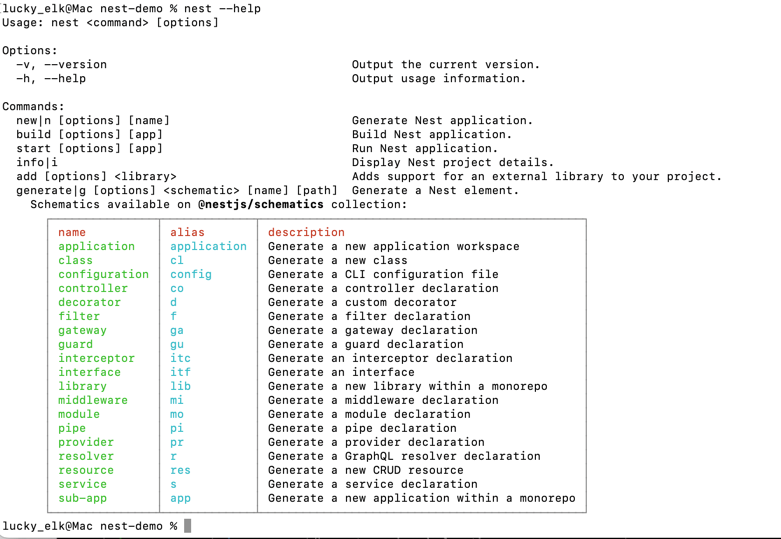
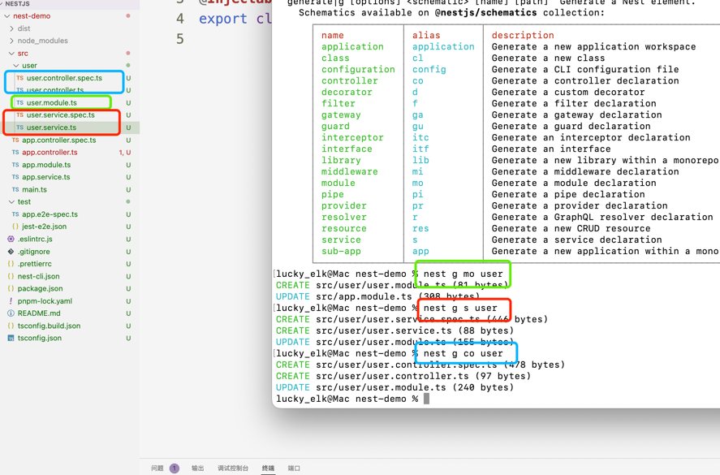
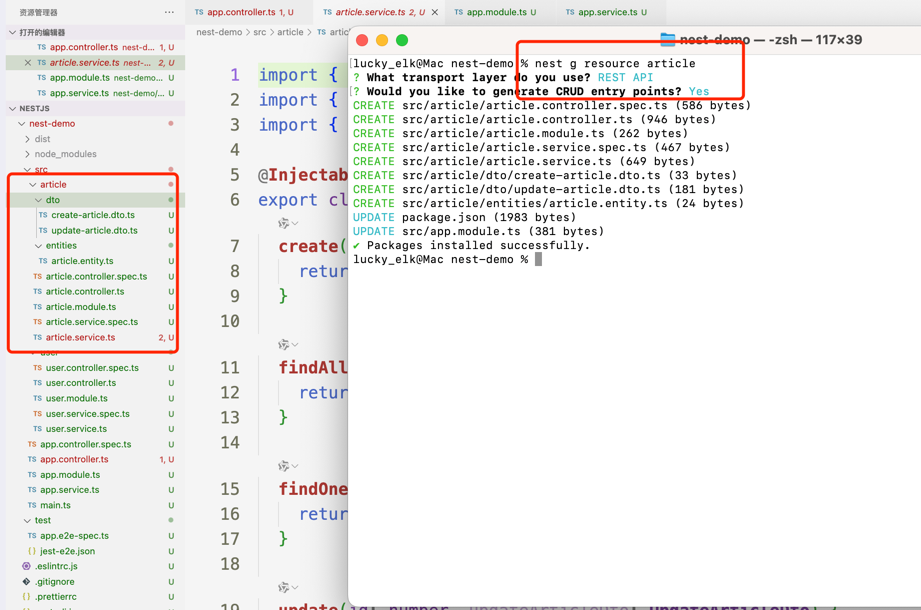

## 常用命令
```shell
# 项目根目录
nest --help
```


## 生成对应的业务模块内容
```shell
# 生成user.module.ts
nest g mo user[业务模块名]
# 生成user.service.ts
nest g s user[业务模块名]
# 生成user.controller.ts
nest g co user[业务模块名]
```


## 快速生成对应的业务模块内容
生成一套标准的CURD 模板
```shell
nest g resource [业务模块名]
```

