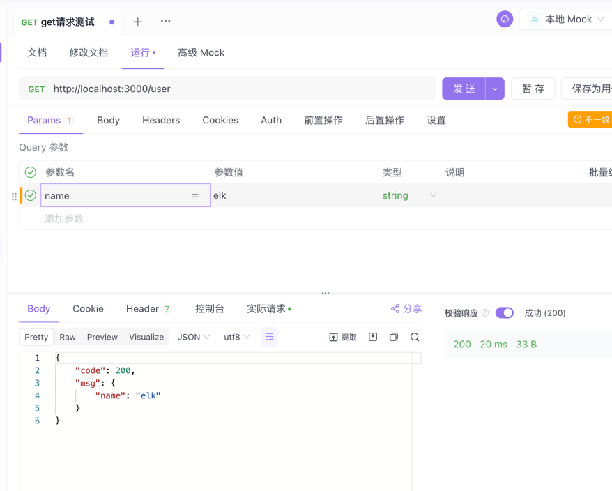
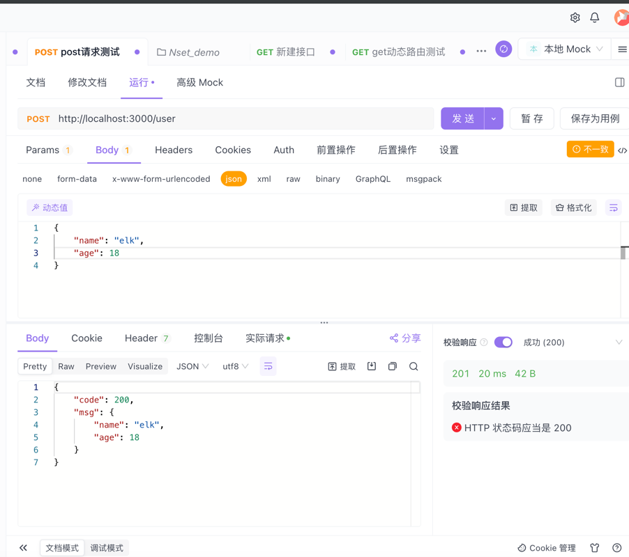
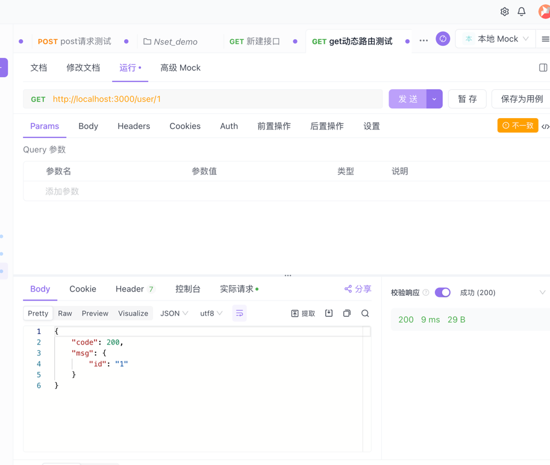
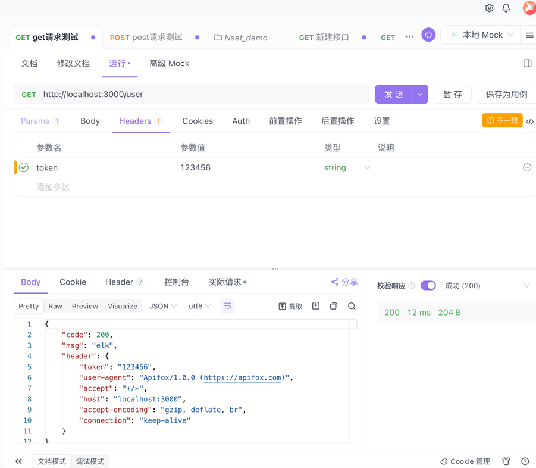

## 介绍
NestJs提供了一些方法参数装饰器用于快速获取参数

| 装饰器         | 使用              |
|-------------|-----------------|
| @Request()  | req             |
| @Response() | res             |
| @Next() | next            |
| @Session() | req.session     |
| @Query(key?: string) | req.query / key |
| @Param(key?: string) | req.params / key |
| @Body(key? : string) | req.body / key |
| @Headers(name? : string) | req.headers | name |
| @HttpCode | |


## 测试工具

Postman: https://www.postman.com/

Apifox: https://apifox.com/

## 案例

### 获取get请求参数

可以使用@Reuqest装饰器或者@Query装饰器

```typescript
// user.controller.ts

import { Controller, Get, Request, Query } from "@nestjs/common";

@Controller('user')
export class UserController {
    /**
     *  使用@Request(): 跟express中的req一样
     *  使用@Query: 一个语法糖直接可以拿到query参数，不需要req.query
     *      也可以直接获取query参数的key
     *         @Query('key') key
     *         请求query：{ "name": "elk", "age": 18 }
     *              @Query('name') name   name = "elk"
     * */
    
    @Get()
    findAll(@Request() req) {
        console.log('🚀 ~ UserController ~ getUser ~ req:', req);
        return {
            code: 200,
            msg: req.query
        }
    }

    @Get()
    findAll(@Query() query) {
        console.log('🚀 ~ UserController ~ getUser ~ query:', query);
        return {
            code: 200,
            msg: query
        }
    }
}
```


### 获取post请求参数
使用@Request装饰器或者@Body装饰器
```typescript
// user.controller.ts

import { Body, Controller, Get, Post, Query, Request } from '@nestjs/common';

@Controller('user')
export class UserController {
    /**
     *  使用@Request(): 跟express中的req一样
     *  使用@Body: 一个语法糖直接可以拿到body参数，不需要req.body
     *      也可以直接获取body参数的key
     *         @Body('key') key
     *         请求body：{ "name": "elk", "age": 18 }
     *              @Body('name') name   name = "elk"
     * */
    
    @Post()
    postUser(@Request() req) {
        console.log('🚀 ~ UserController ~ postUser ~ req:', req);
        return {
            code: 200,
            msg: req.body,
        };
    }
    postUser(@Body() body) {
        console.log('🚀 ~ UserController ~ postUser ~ body:', body);
        return {
          code: 200,
          msg: body,
        };
    }
    postUser(@Body('name') name) {
        console.log('🚀 ~ UserController ~ postUser ~ name:', name);
        return {
            code: 200,
            msg: name,
        };
    }
}
```


### 获取get动态路由参数
使用@Request装饰器或者@Param装饰器
```typescript
// user.controller.ts
import { Controller, Get, Request, Param } from "@nestjs/common";

@Controller('user')
export class UserController {
    /**
     *  使用@Request(): 跟express中的req一样
     *  使用@Param: 一个语法糖直接可以拿到params参数，不需要req.params
     * */
    @Get(':id')
    getUserSingle(@Request() req) {
        console.log('🚀 ~ UserController ~ getUserSingle ~ req:', req);
        return {
            code: 200,
            msg: req.params
        }
    }
    getUserSingle(@Param() params) {
        console.log('🚀 ~ UserController ~ getUserSingle ~ params:', params);
        return {
            code: 200,
            msg: params
        }
    }
}
```


### 获取header信息
使用@Headers装饰器
```typescript
// user.controller.ts
import { Controller, Get, Request, Headers } from "@nestjs/common";

@Controller('user')
export class UserController {
    /**
     *  使用@Headers(): 返回header信息
     * */
    @Get()
    findAll(@Request() req, @Headers() headers) {
        console.log('🚀 ~ UserController ~ getUser ~ headers:', headers);
        return {
            code: 200,
            msg: req.query,
            headers,
        }
    }
}
```

