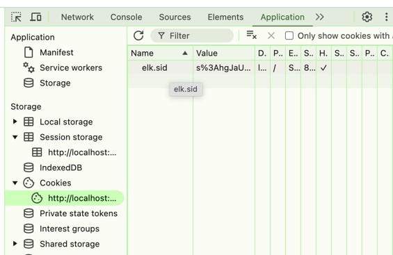
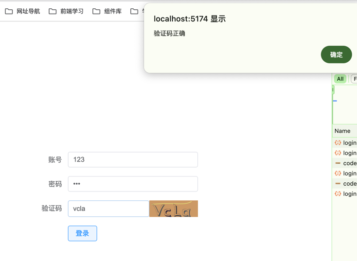

## 介绍
Session 是一种服务器端存储机制，用于存储用户会话信息。它允许服务器在多次HTTP请求之间保持状态，这与HTTP协议的无状态特性相对。Session通常用于实现用户认证和个性化用户体验。

## 依赖及配置
当前使用的NestJs默认框架基于express，也能使用基于express的插件
```shell
pnpm i express-session --save

# 智能提示
pnpm i @types/express-session -D
```
```typescript
// main.ts
import * as session from 'express-session';

app.user(
    session({
        secret: 'lucky', //生成服务端session 签名 可以理解为加盐
        name: 'elk.sid', //生成客户端cookie 的名字 默认 connect.sid
        resave: false,
        rolling: true, //在每次请求时强行设置 cookie，这将重置 cookie 过期时间(默认:false)
        saveUninitialized: true,
        cookie: { secure: false },
    })  
)
```

## 案例
### 验证码
- 前端： vue3 + element-plus fetch 
```shell
npm install element-plus -S
```
- 前端界面
```vue
<template>
    <div class="wraps">
         <el-form :label-position="labelPosition" label-width="100px" :model="formLabelAlign" style="max-width: 460px">
              <el-form-item label="账号">
                   <el-input v-model="formLabelAlign.name" />
              </el-form-item>
              <el-form-item label="密码">
                   <el-input type="password" v-model="formLabelAlign.password" />
              </el-form-item>
              <el-form-item label="验证码">
                   <div style="display:flex">
                        <el-input  v-model="formLabelAlign.code" />
                        
                   </div>
              </el-form-item>
              <el-form-item>
                   <el-button @click="submit">登录</el-button>
              </el-form-item>
         </el-form>
    </div>
</template>
    
<script setup lang='ts'>
import { onMounted, reactive, ref } from 'vue';

const codeUrl = ref<string>('/api/user/code')

const resetCode = () => codeUrl.value = codeUrl.value + '?' + Math.random()

const labelPosition = ref<string>('right')

const formLabelAlign = reactive({
    name: "",
    password: "",
    code: ""
})

const submit = async () => {
    await fetch('/api/user/login', {
         method: "POST",
         body: JSON.stringify(formLabelAlign),
         headers: {
              'content-type': 'application/json'
         }
    }).then(res => res.json()).then( res => {
         if(res.code === 200) {
            alert(res.msg)
         }else {
            alert(res.msg)
         }
    })
}
```
- 后端： nestjs + svg-captcha
```shell
npm install svg-captcha -S
```
- user.controller.ts
```typescript
import { Req, Res, Controller, Get, Post, Body } from '@nestjs/common';
import { UserService } from './user.service';
@Controller('user')
export class UserController {
  constructor(private readonly userService: UserService) {}
    
  // 验证码图片  
  @Get('code')
  createCatptcha(@Req() req, @Res() res) {
    const captcha = this.userService.setCode();
    req.session.code = captcha.text;
    res.type('image/svg+xml');
    res.send(captcha.data);
  }
  
  // 登录验证
  @Post('login')
  createUser(@Req() req, @Body() body) {
    if (
      body.code.toLocaleLowerCase() === req.session.code.toLocaleLowerCase()
    ) {
      return {
        code: 200,
        msg: '验证码正确',
      };
    } else {
      return {
        code: 500,
        msg: '验证码错误',
      };
    }
  }
}
```
- user.service.ts
```typescript
import { Injectable } from '@nestjs/common';
import * as svgCaptcha from 'svg-captcha';

interface Captcha {
  text: string;
  data: string;
}
@Injectable()
export class UserService {
  setCode(): Captcha {
    const captcha = svgCaptcha.create({
      size: 4, //生成几个验证码
      fontSize: 50, //文字大小
      width: 100, //宽度
      height: 34, //高度
      background: '#cc9966', //背景颜色
    });
    return captcha;
  }
}
```

