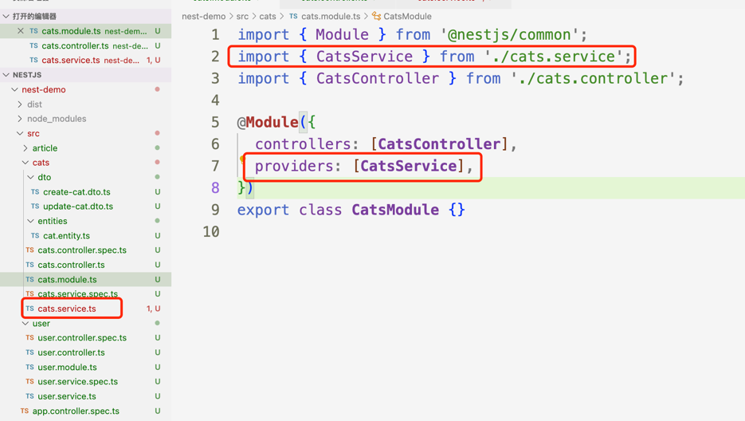
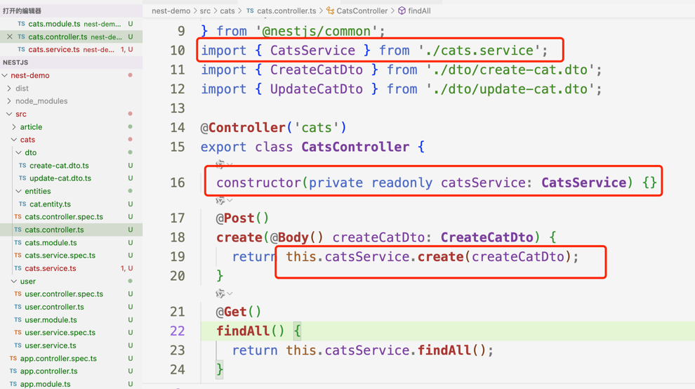
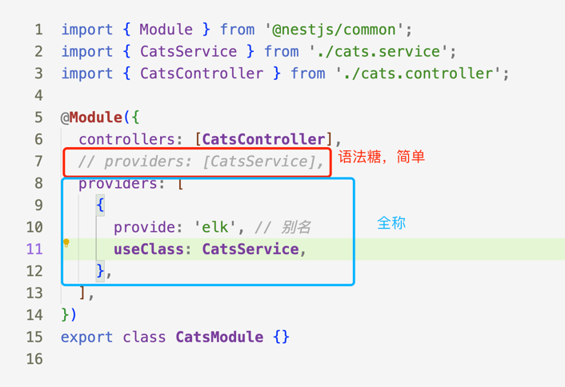
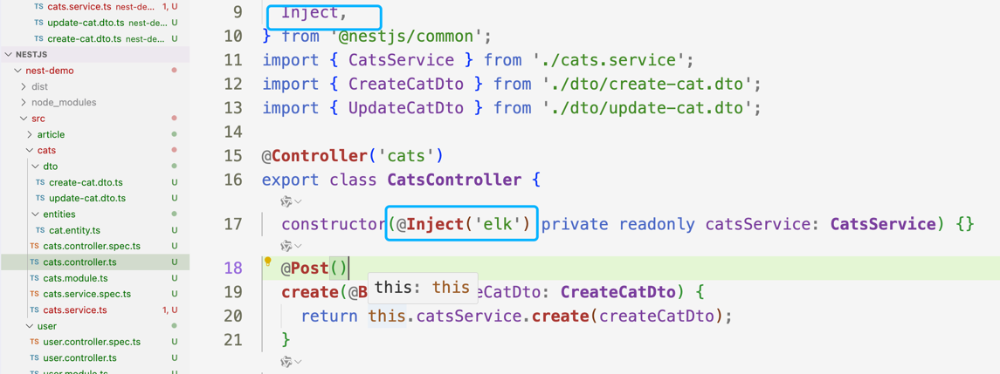
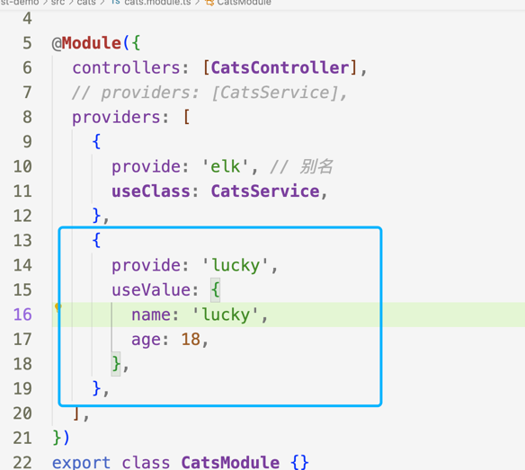
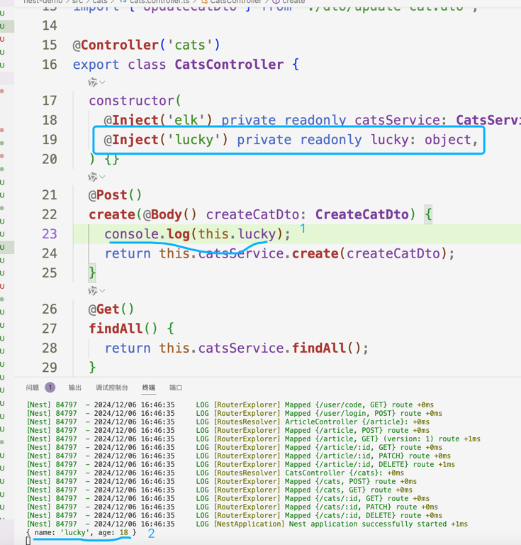
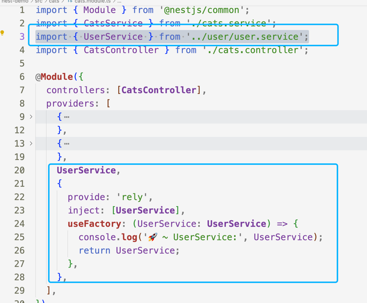
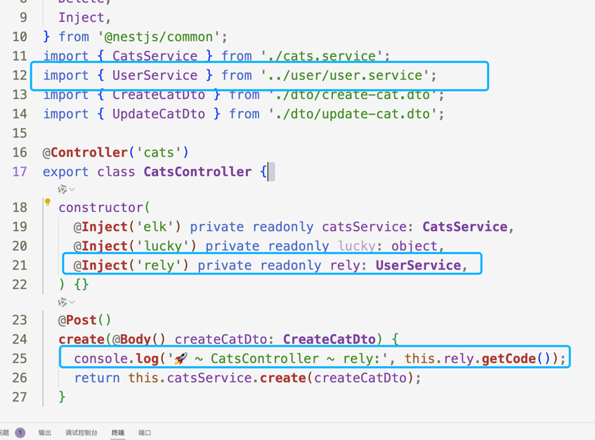
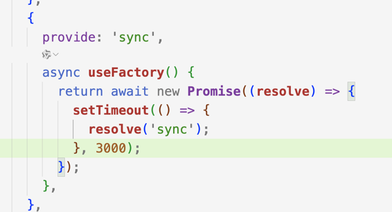

## 概述
Providers 是 Nest 的一个基本概念。许多基本的 Nest 类都可能被视为 provider - service, repository, factory, helper 等等。 他们都可以通过 constructor 注入依赖关系。 这意味着对象可以彼此创建各种关系，并且“连接”对象实例的功能在很大程度上可以委托给 Nest运行时系统。 Provider 只是一个用 @Injectable() 装饰器注释的类。

## 基本使用
在Module中引入service注入到providers

此时在controller中就能使用注入的service

## 自定义名称

第一中基本使用其实是语法糖，全称是这样的

在controller中需要用对应的inject去取，不然报错找不到

## 自定义注入值

在module中注入通过useValue属性

## 工厂模式
如果服务 之间有相互的依赖 或者逻辑处理 可以使用 useFactory

## 异步模式
useFactory 返回一个promise 或者其他异步操作

