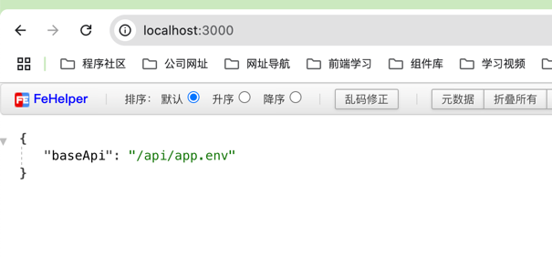

## 概述
模块是具有 @Module() 装饰器的类。 @Module() 装饰器提供了元数据，Nest 用它来组织应用程序结构。

每个 Nest 应用程序至少有一个模块，即根模块。根模块是 Nest 开始安排应用程序树的地方。事实上，根模块可能是应用程序中唯一的模块，特别是当应用程序很小时，但是对于大型程序来说这是没有意义的。在大多数情况下，您将拥有多个模块，每个模块都有一组紧密相关的功能。

@Module() 装饰器接收一个描述模块属性的对象

| 标题 | 描述 |
| ---- | ---- |
| providers | 由 Nest 注入器实例化的提供者，并且可以至少在整个模块中共享 |
| controllers | 必须创建的一组控制器 |
| imports | 导入模块的列表，这些模块导出了此模块中所需提供者 |
| exports | 由本模块提供并应在其他模块中可用的提供者的子集 |

## 基本使用
使用 nest g res [模块名]，会帮我们创建一个标准的CRUD，并在app.module.ts中注册


## 共享模块
默认情况下，模块是单例的，因此可以轻松的在多个模块之间共享同一个提供者实例


实际上，每个模块都是一个共享模块。一旦创建就能被任意模块重复使用。假设我们将在几个模块之间共享 CatsService 实例。 我们需要把 CatsService 放到 exports 数组中，如下所示：


## 全局模块

将user.module.ts变为全局模块，但是也需要通过exports导出


此时无需在article.module引入注册，可直接在article.controller中使用


<br/>

> **如果没有通过@Global()将模块变成全局模块，其他模块使用需在当前模块进行引入**


## 动态模块
Nest 模块系统包括一个称为动态模块的强大功能。此功能使您可以轻松创建可自定义的模块，这些模块可以动态注册和配置提供程序。

### config.module.ts
```typescript
import { Module, Global, DynamicModule } from '@nestjs/common';
interface Options {
  path: string;
}
@Global()
@Module({})
export class ConfigModule {
  static forRoot(options: Options): DynamicModule {
    return {
      module: ConfigModule,
      providers: [
        {
          provide: 'CONFIG',
          useValue: {
            baseApi: '/api' + options.path,
          },
        },
      ],
      exports: [
        {
          provide: 'CONFIG',
          useValue: {
            baseApi: '/api' + options.path,
          },
        },
      ],
    };
  }
}
```
### app.module.ts


### app.controller.ts


### 访问


