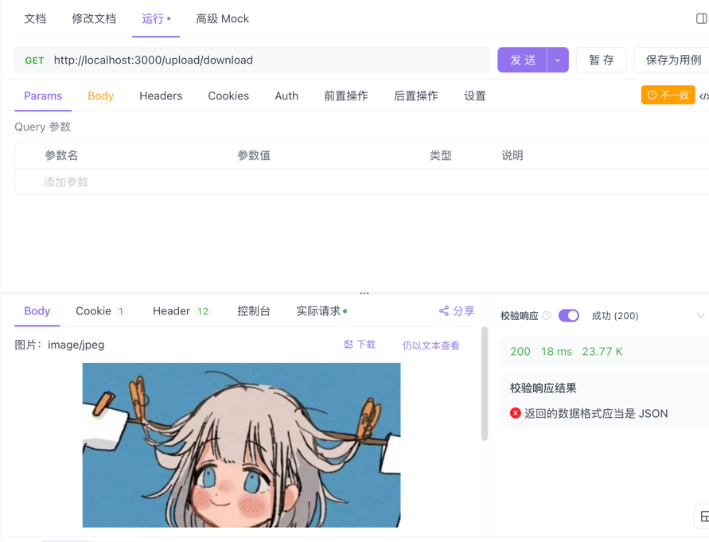

## 概述
NestJS是基于Express的框架，底层还是使用Express的响应对象来处理文件下载。常见的文件下载方式有直接发送文件流，或者设置响应头让浏览器自动下载。

> 1、使用express的response对象 - download直接下载
> 
> 2、通过文件流的方式

## download直接下载

- upload.controller.ts
```typescript
import {
    Controller,
    Get,
    Post,
    Body,
    Patch,
    Param,
    Delete,
    UseInterceptors,
    UploadedFile,
    Res,
} from '@nestjs/common';
import { UploadService } from './upload.service';
import { UpdateUploadDto } from './dto/update-upload.dto';
import { FileInterceptor } from '@nestjs/platform-express';
import type { Response } from 'express';
import { join } from 'path';

@Controller('upload')
export class UploadController {
    constructor(private readonly uploadService: UploadService) {}
    
    @Get('download')
    downloadFile(@Res() res: Response) {
        // 模拟下载指定文件，正常是存库查找下载
        const url = join(
            __dirname,
            '../static',
            '/uploads/1739262462627-avatar.jpg',
        );
        res.download(url, (err) => {
            if (err) {
                res.status(404).send('文件不存在');
            }
        });
    }
}
```


## 文件流方式下载

nest官方处理流文件用到的是 StreamableFile  [官方示例](https://docs.nestjs.cn/10/techniques?id=%e6%b5%81%e5%a4%84%e7%90%86%e6%96%87%e4%bb%b6)

这边用到了一个插件 compressing 将其压缩到一个zip包
```shell
npm install compressing
```
- upload.controller.ts
```typescript
import {
  Controller,
  Get,
  Post,
  Body,
  Patch,
  Param,
  Delete,
  UseInterceptors,
  UploadedFile,
  Res,
} from '@nestjs/common';
import { UploadService } from './upload.service';
import { UpdateUploadDto } from './dto/update-upload.dto';
import { FileInterceptor } from '@nestjs/platform-express';
import type { Response } from 'express';
import { join } from 'path';
import { zip } from 'compressing';

@Controller('upload')
export class UploadController {
  constructor(private readonly uploadService: UploadService) {}

  @Post('album')
  @UseInterceptors(FileInterceptor('file'))
  UploadFile(@UploadedFile() file: Express.Multer.File) {
    console.log('获取当前文件: ', file);
    return '上传了，成功不成功不知道！';
  }

  @Get('download')
  downloadFile(@Res() res: Response) {
    // 模拟下载指定文件，正常是存库查找下载
    const url = join(
      __dirname,
      '../static',
      '/uploads/1739262462627-avatar.jpg',
    );
    res.download(url, (err) => {
      if (err) {
        res.status(404).send('文件不存在');
      }
    });
  }

  @Get('stream')
  async downStream(@Res() res: Response) {
    const url = join(
      __dirname,
      '../static',
      '/uploads/1739262462627-avatar.jpg',
    );
    const tarStream = new zip.Stream();
    tarStream.addEntry(url);

    // 文件不存在，给出提示
    tarStream.on('error', (err) => {
      if (err) {
        res.status(404).send('文件不存在');
      }
    });
    res.setHeader('Content-Type', 'application/octet-stream');
    res.setHeader('Content-Disposition', `attachment; filename=elk`);

    tarStream.pipe(res);
  }
}
```
- 前端代码
```vue
<template>
  <button @click="download">下载</button>
</template>

<script setup lang="ts">

const useFetch = async (url: string) => {
  const res = await fetch(url).then( res => res.arrayBuffer());
  const a = document.createElement('a');
  a.href = URL.createObjectURL( new Blob([res]));
  a.download = 'elk.zip';
  a.click();
}

const download = () => {
  // 1.download直接下载
  window.open("/api/upload/download");
  // 2.文件流下载
  useFetch('/api/upload/stream')
}
</script>
```
