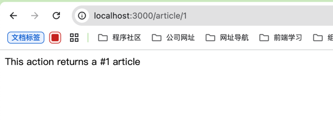
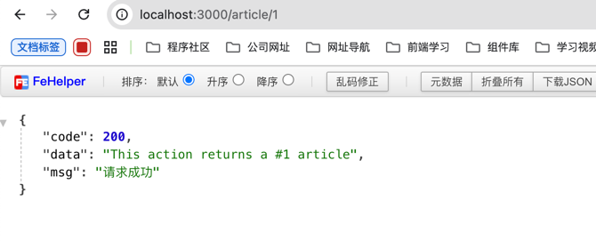
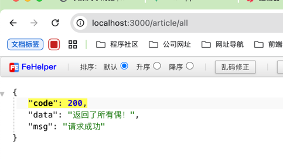
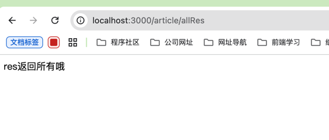

## 概述
拦截器是使用 @Injectable() 装饰器注解的类。拦截器应该实现 NestInterceptor 接口。

拦截器具有一系列有用的功能，这些功能受面向切面编程（AOP）技术的启发。它们可以：

* 在函数执行之前/之后绑定额外的逻辑
* 转换从函数返回的结果
* 转换从函数抛出的异常
* 扩展基本函数行为
* 根据所选条件完全重写函数 (例如, 缓存目的)

## 案例
将后端将返回的数据通过包装返给前端一个指定的json格式


例如：
```json
{
  "code": 200,
  "msg": "请求成功",
  "data": "返回的数据"
}
```
在 /src/common/Response.ts
```typescript
import { Injectable, NestInterceptor, CallHandler  } from '@nestjs/common';
import { Observable } from 'rxjs';
import  { map } from 'rxjs/operators';

interface Data<T> {
    data: T
}

export class ResponseInterceptor<T> implements NestInterceptor {
    intercept(context, next: CallHandler): Observable<Data<T>> {
        return next.handle().pipe(
            map((data) => {
                return {
                    code: 200,
                    data,
                    msg: "请求成功"
                }
            })
        )
    }
}
```

在main.ts中注入使用
```typescript
import { ResponseIntercepter } from './common/Response';

app.useGlobalInterceptors(new ResponseIntercepter());
```
引入前后对比






## 注意

> 接口返回如果使用了res，nest的拦截器会失效

在某个xxx.controller.ts中

```typescript
@Get('all')
getAll() {
    return '返回了所有偶！'
}

@Get('allRes')
getAll(@Res() res) {
    res.send("res返回所有哦")
}

```



