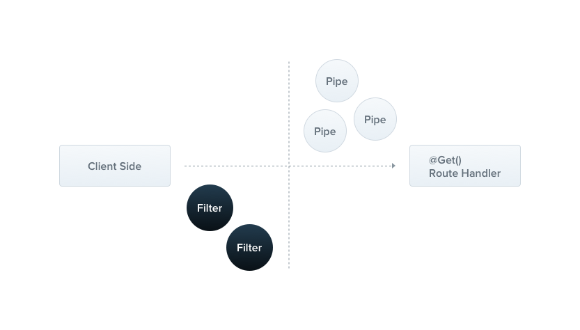
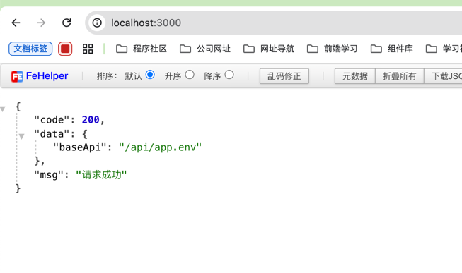
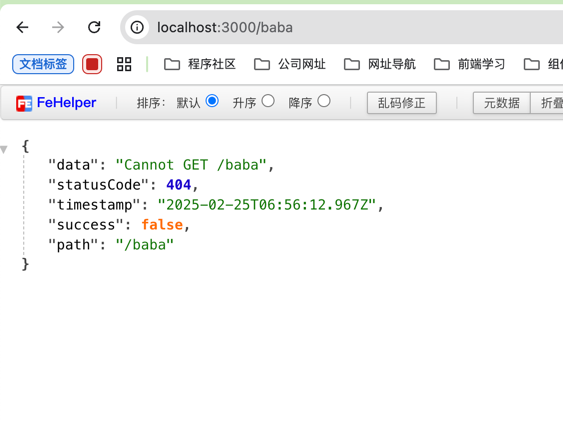

## 概述
内置的异常层负责处理整个应用程序中的所有抛出的异常。当捕获到未处理的异常时，最终用户将收到友好的响应。



开箱即用，此操作由内置的全局异常过滤器执行，该过滤器处理类型 HttpException（及其子类）的异常。每个发生的异常都由全局异常过滤器处理, 当这个异常无法被识别时 (既不是 HttpException 也不是继承的类 HttpException )
## 官方案例

虽然基本（内置）异常过滤器可以为您自动处理许多情况，但有时您可能希望对异常层拥有完全控制权，例如，您可能希望基于某些动态因素添加日志记录或使用不同的 JSON 模式。 异常过滤器正是为此目的而设计的。 它们使您可以控制精确的控制流以及将响应的内容发送回客户端。

让我们创建一个异常过滤器，它负责捕获作为HttpException类实例的异常，并为它们设置自定义响应逻辑。为此，我们需要访问底层平台 Request和 Response。我们将访问Request对象，以便提取原始 url并将其包含在日志信息中。我们将使用 Response.json()方法，使用 Response对象直接控制发送的响应。

- /src/common/ErrorFilter.ts

```typescript
/**
 * 从 NestJS 框架中导入所需的模块
 * ExceptionFilter 用于定义异常过滤器
 * Catch 是一个装饰器，用于指定要捕获的异常类型
 * ArgumentsHost 提供对当前执行上下文的访问
 * HttpException 是 NestJS 中用于表示 HTTP 异常的类
 */
import {
    ExceptionFilter,
    Catch,
    ArgumentsHost,
    HttpException,
} from '@nestjs/common';
/**
 * 从 Express 框架中导入 Request 和 Response 类型
 * Request 表示 HTTP 请求对象
 * Response 表示 HTTP 响应对象
 */
import { Request, Response } from 'express';

/**
 * 使用 @Catch 装饰器指定捕获 HttpException 类型的异常
 * 该装饰器将 HttpExceptionFilter 类标记为专门处理 HttpException 异常的过滤器
 */
@Catch(HttpException)
/**
 * 定义一个名为 HttpExceptionFilter 的类，该类实现了 ExceptionFilter 接口
 * 用于捕获和处理 NestJS 应用中的 HttpException 异常
 */
export class HttpExceptionFilter implements ExceptionFilter {
    /**
     * 捕获并处理 HttpException 异常
     *
     * @param exception - 捕获到的 HttpException 异常实例
     * @param host - 用于访问当前执行上下文的 ArgumentsHost 对象
     */
    catch(exception: HttpException, host: ArgumentsHost) {
        // 从 ArgumentsHost 对象中切换到 HTTP 上下文
        const ctx = host.switchToHttp();
        // 从 HTTP 上下文中获取响应对象
        const response = ctx.getResponse<Response>();
        // 从 HTTP 上下文中获取请求对象
        const request = ctx.getRequest<Request>();
        // 从异常实例中获取 HTTP 状态码
        const status = exception.getStatus();

        // 设置响应的状态码，并以 JSON 格式返回响应数据
        response.status(status).json({
            // 异常消息
            data: exception.message,
            // HTTP 状态码
            statusCode: status,
            // 当前时间戳，格式为 ISO 字符串
            timestamp: new Date().toISOString(),
            // 表示请求是否成功
            success: false,
            // 请求的路径
            path: request.url,
        });
    }
}
```
- main.ts
```typescript
// 引入封装的异常过滤器
import { HttpExceptionFilter } from './common/ErrorFilter';

// 注册异常过滤器
app.useGlobalFilters(new HttpExceptionFilter());
```
- 验证




