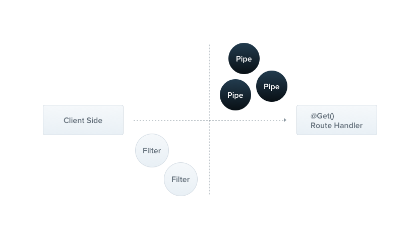
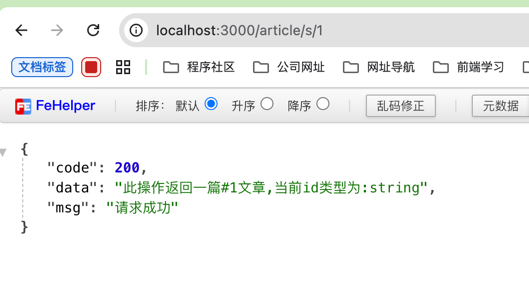
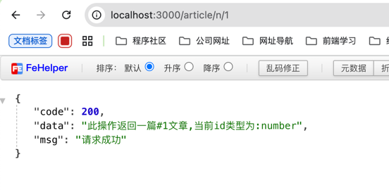
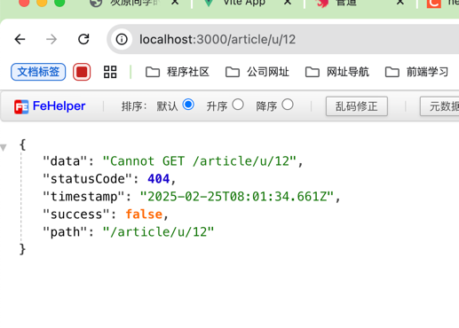
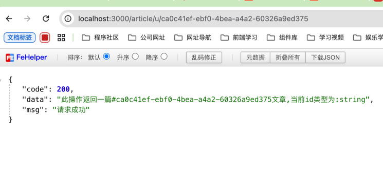

## 概述
管道是具有 @Injectable() 装饰器的类。管道应实现 PipeTransform 接口。


管道有两个典型的应用场景:

- 转换：管道将输入数据转换为所需的数据输出(例如，将字符串转换为整数)
- 验证：对输入数据进行验证，如果验证成功继续传递; 验证失败则抛出异常

在这两种情况下, 管道 参数(arguments) 会由 控制器(controllers)的路由处理程序 进行处理。Nest 会在调用这个方法之前插入一个管道，管道会先拦截方法的调用参数,进行转换或是验证处理，然后用转换好或是验证好的参数调用原方法。

Nest自带很多开箱即用的内置管道。你还可以构建自定义管道。本章将先介绍内置管道以及如何将其绑定到路由处理程序(route handlers)上，然后查看一些自定义管道以展示如何从头开始构建自定义管道。

内置管道
* ValidationPipe
* ParseIntPipe
* ParseFloatPipe
* ParseBoolPipe
* ParseArrayPipe
* ParseUUIDPipe
* ParseEnumPipe
* DefaultValuePipe
* ParseFilePipe

## 案例

### 动态参数id类型为number，现在是string

article.controller.ts
```typescript
import  { ParseIntPipe, Get, Param } from '@nestjs/common';

export  class  ArticleController {
    @Get('s/:id')
    findOne(@Param('id') id: string) {
        console.log('参数类型：', typeof id);
        return this.articleService.findOne(id);
    }

    @Get('n/:id')
    findOne(@Param('id', ParseIntPipe) id: number) {
        console.log('参数类型：', typeof id);
        return this.articleService.findOne(id);
    }  
}
```




### 验证UUID

- 插件安装
```shell
pnpm install uuid -S
pnpm install @types/uuid -D
```
- 案例实现
```typescript
import  { ParseUUIDPipe, Get, Param } from '@nestjs/common';

// 引入、生成uuid用于验证
import * as uuid from 'uuid';

console.log("uuid", uuid.v4());

export  class  ArticleController {
    @Get('u/:id')
    findOne(@Param('id', ParseUUIDPipe) id: string) {
        return this.articleService.findOne(id);
    }
}
```




