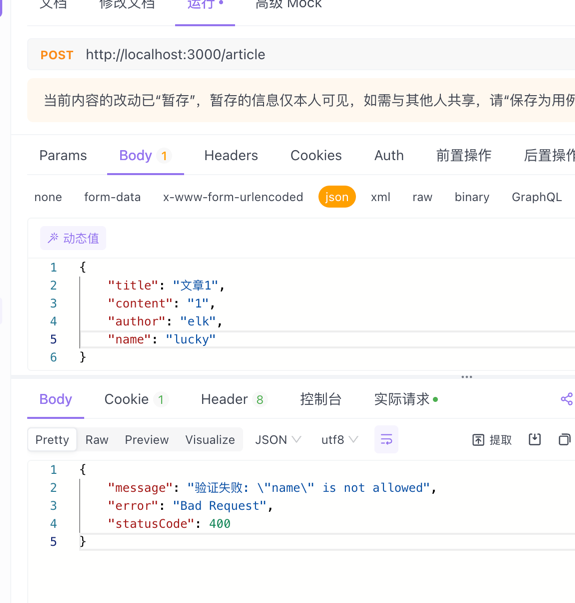
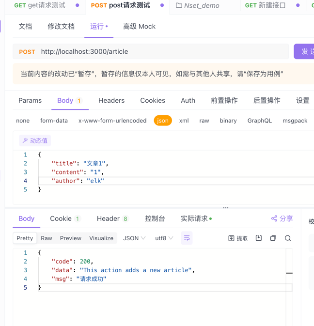
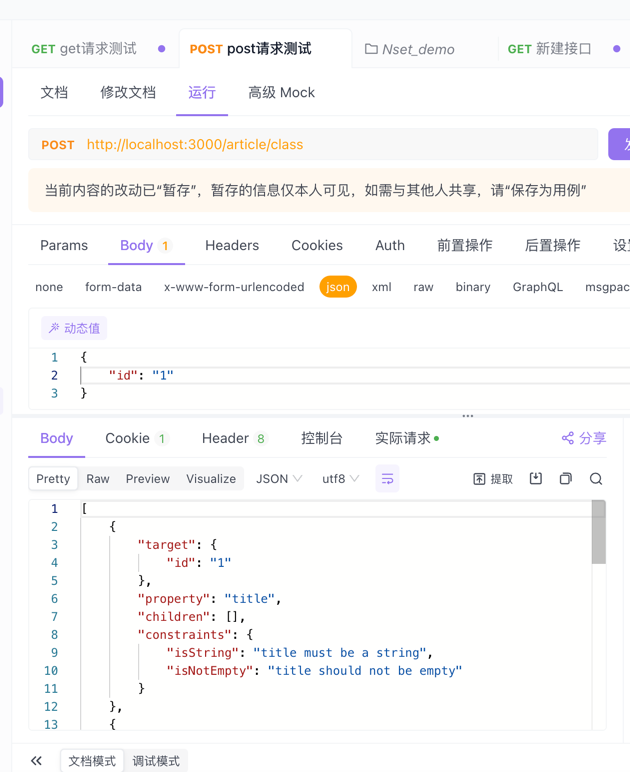
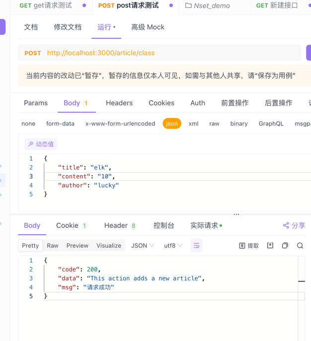
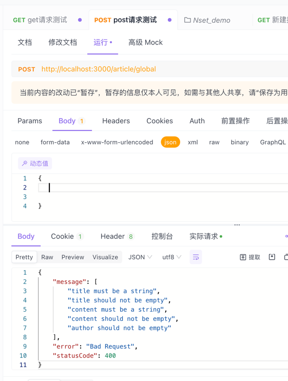

## 概述
上文说到管道有两个典型的应用场景「转换、验证」，今天重点说说验证。

> 验证：对输入数据进行验证，如果验证成功继续传递; 验证失败则抛出异常

### 基于结构的验证
当我们使用 nest g res 「模块名」 生成的快捷模块，会帮我们生成一个标准模版，其中含有dto文件以及请求主体参数类型为dto的参数

- article.controller.ts
```typescript
import {
    Post,
    Body,
} from '@nestjs/common';
import { ArticleService } from './article.service';
import { CreateArticleDto } from './dto/create-article.dto';
import { UpdateArticleDto } from './dto/update-article.dto';
export class  ArticleController {
    constructor(
        private readonly articleService: ArticleService,
        private readonly userService: UserService,
    ) {}
    
    @Post()
    create(@Body() createArticleDto: CreateArticleDto) {
        return this.articleService.create(createArticleDto);
    }
}
```
> 请求体参数为 createArticleDto，其类型为 createArticleDto 

- /dto/create-article.dto.ts
```typescript
export class CreateArticleDto {
  title: string;
  content: string;
  author: string;
}
```
此时我们希望当前请求方法接收的请求主体是有效的，必须符合createArticleDto对象中的三个成员的要求，
下面有两种验证方法，下面挨个介绍

### 对象结构验证
这是一种基于结构的验证，使用到的插件「Joi」
> Joi 库允许使用可读的 API 以直接的方式创建 schema，构建一个基于 Joi schema 的验证管道。
```shell
npm install --save joi
npm install --save-dev @types/joi
```

我们可以通过脚本  nest g pipe article 快速生成一个article.pipe.ts的文件

- article.pipe.ts
```typescript
import {
  PipeTransform,
  Injectable,
  ArgumentMetadata,
  BadRequestException,
} from '@nestjs/common';
import { ObjectSchema } from 'joi';

@Injectable()
export class ArticlePipe implements PipeTransform {
  /**
   * 构造函数，用于初始化 ArticlePipe 类的实例
   *
   * @param schema - Joi 的 ObjectSchema 类型的对象，用于验证数据
   */
  constructor(private schema: ObjectSchema) {}
  /**
   * 实现 PipeTransform 接口的 transform 方法，用于在管道中转换和验证数据
   *
   * @param value - 要转换和验证的数据
   * @param metadata - 包含参数的元数据，如类型、数据路径等
   * @returns 经过转换或验证后的数据
   */
  transform(value: any, metadata: ArgumentMetadata) {
    // 使用 Joi 模式对传入的数据进行验证，解构出验证结果中的 error 属性
    const { error } = this.schema.validate(value);
    // 检查是否存在验证错误
    if (error) {
      // 如果存在错误，抛出 BadRequestException 异常，并附带具体的错误信息
      throw new BadRequestException(`验证失败: ${error.message}`);
    }
    // 打印参数的元数据信息，用于调试
    console.log('🚀 ~ ArticlePipe ~ transform ~ metadata:', metadata);
    // 打印要转换和验证的数据，用于调试
    console.log('🚀 ~ ArticlePipe ~ transform ~ value:', value);
    // 直接返回原始数据，未进行实际的转换或验证操作
    return value;
  }
}
```
### 绑定验证管道
上述方法创建好了验证方法，我们需要到指定方法中去进行绑定验证


新建.schema.ts文件定义数据的验证规则
- create-article.schema.ts
```typescript
import * as Joi from 'joi';
// 定义创建文章的验证模式
export const createArticleSchema = Joi.object({
  // 标题为字符串类型，必填
  title: Joi.string().required(),
  // 内容为字符串类型，必填
  content: Joi.string().required(),
  // 作者为字符串类型，必填
  author: Joi.string().required(),
  // 发布日期为日期类型，可选
  publishedAt: Joi.date(),
});
```
- article.controller.ts
```typescript
import {
    Post,
    Body,
    UsePipes
} from '@nestjs/common';
import { CreateArticleDto } from './dto/create-article.dto';

import { ArticlePipe } from './article.pipe';
import { createArticleSchema } from './create-article.schema';

export class  ArticleController {
    @Post()
    @UsePipes(new ArticlePipe(createArticleSchema))
    create(@Body() createArticleDto: CreateArticleDto) {
        return this.articleService.create(createArticleDto);
    }
}
```
- 不符合规则的时候就会出现提示「缺少某个字段」


「多了某个字段」



- 当我们满足条件之后



### 类验证
Nest与class-validator相互配合，基于装饰器的验证，通过装饰器的方式给dto数据添加规则

[class-validator-科学上网](https://github.com/typestack/class-validator)

[class-transformer-科学上网](https://github.com/typestack/class-transformer)
```shell
npm i --save class-validator class-transformer

# 需要用的上面两个插件工具
```
- create-article.dto.ts
```typescript
import { IsNotEmpty, IsString } from 'class-validator';
export class CreateArticleDto {
  @IsNotEmpty() // 验证是否为空
  @IsString() // 验证是否为字符串
  title: string;
  @IsNotEmpty()
  @IsString()
  content: string;
  @IsNotEmpty()
  author: string;
}
```
- article.pipe.ts
```typescript
import {
  ArgumentMetadata,
  Injectable,
  PipeTransform,
  HttpException,
  HttpStatus,
} from '@nestjs/common';
import { validate } from 'class-validator';
import { plainToInstance } from 'class-transformer';

@Injectable()
export class ArticleClassPipe implements PipeTransform {
  async transform(value: any, metadata: ArgumentMetadata) {
    // 验证是否为类  
    if (!metadata.metatype || !this.toValidate(metadata.metatype)) {
      return value;
    }
    /**
     * value: 请求参数: 请求接收的参数
     * metadata: 请求参数的元数据: { metatype: [class CreateArticleDto], type: 'body', data: undefined }
     * plainToInstance: 将普通对象转换为类的实例
     * validate: 验证类的实例
     */
    const DTO = plainToInstance(metadata.metatype, value);
    const error = await validate(DTO);
    if (error.length > 0) {
      throw new HttpException(error, HttpStatus.BAD_REQUEST);
    }
    return value;
  }
  // 判断是否为类
  private toValidate(metatype: Function): boolean {
    const types: Function[] = [String, Boolean, Number, Array, Object];
    return !types.includes(metatype);
  }
}
```
#### 绑定使用
- article.controller.ts
```typescript
import {
    Post,
    Body,
} from '@nestjs/common';
import { CreateArticleDto } from './dto/create-article.dto';
import { ArticlePipe } from './article.pipe';

export class  ArticleController {
    @Post('class')
    create(@Body(new ArticlePipe()) createArticleDto: CreateArticleDto) {
        return this.articleService.create(createArticleDto);
    }
}
```
- 不满足条件时： 将不满足的要求返回回来是个数据对象



- 满足条件



### 全局管道

由于管道创建需求可能是通用，不然每个模块一个管道很是繁琐，nestjs也想到了这一点，含有一个全局管道，用于整个应用程序中的每个路由处理器，
效果跟上面类的案例差不多。
- main.ts
```typescript
import { ValidationPipe } from '@nestjs/common';

// 注册全局管道
app.useGlobalPipes(new ValidationPipe());
```
- article.controller.ts
```typescript
import {
    Post,
    Body,
} from '@nestjs/common';
import { CreateArticleDto } from './dto/create-article.dto';

export class  ArticleController {
    @Post('global')
    create(@Body() createArticleDto: CreateArticleDto) {
        return this.articleService.create(createArticleDto);
    }
}
```


