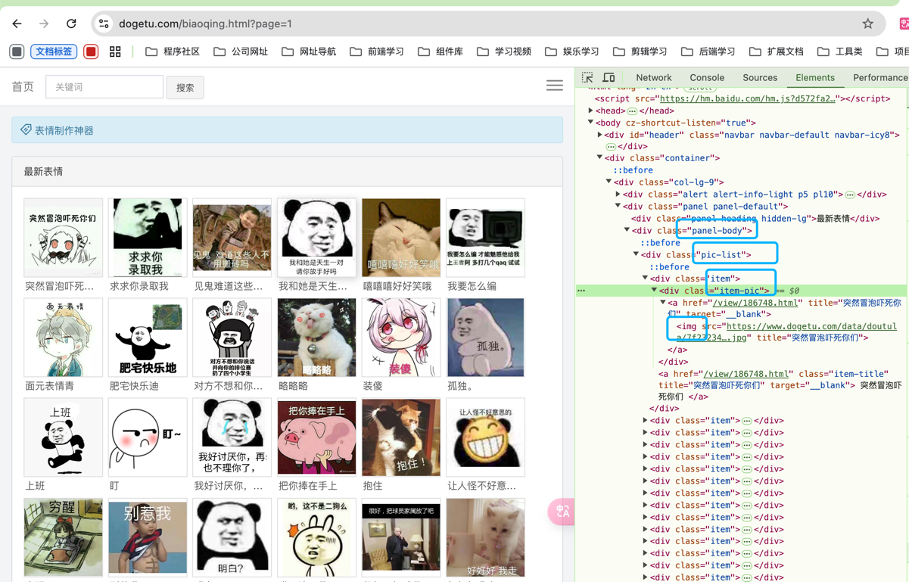

## 概述
爬虫（Web Crawler）是一种自动获取互联网信息的程序或脚本，它可以在网页上自动抓取信息、提取数据并进行处理。爬虫通常通过网络协议（如HTTP）访问网站，按照一定的规则和算法浏览网页并收集所需的信息。

爬虫是一种十分强大的工具，可以帮助我们快速有效的获取网络上的信息，但是我们在使用的时候也要谨慎，避免对目标网站造成过大的访问压力或者是造成目标网站的崩溃，损失其权益。

## 插件

### cheerio
Cheerio 是一个基于 jQuery 核心原则的快速、灵活、专门用于在服务器端实现 DOM 操作的工具。它主要用于解析和操作 HTML 文档，提供了类似 jQuery 的 API，使得在服务器端（如 Node.js 环境）可以方便地对 HTML 进行操作和提取所需信息。

### axios
网络请求库可以发送http请求

```shell
npm install cheerio -S
npm install axios -S
```
## 案例
爬取一个表情包的网页，将表情包下载下来

[斗了个图表情包大全](https://www.dogetu.com/biaoqing.html)

### 选取网页url，请求获取网页的数据
```typescript
const baseUrl = 'https://www.dogetu.com';
// 发送 HTTP 请求获取表情包页面的 HTML 内容
const res = await axios.get(`${baseUrl}/biaoqing.html`);
```
### 使用cheerio工具获取网页并进行捕获和解析

```typescript
const res = '请求数据'
const $ = cheerio.load(res.data);
const urls = [];
const list = $('.panel-body .pic-list .item .item-pic img');
list.each(function (index, item) {
    // 将图片的 src 属性值添加到 urls 数组中
    urls.push($(this).attr('src'));
});
// urls： 所有图片的src路径
```
### 根据图片url，下载到本地
```typescript
// 拿到了urls，写一个方法下载图片到本地
writeImages(urls: string[]) {
    // 遍历每个图片 URL
    urls.forEach(async (url) => {
        // 发送 HTTP 请求获取图片的二进制数据
        const buffer = await axios.get(url, {
            // 设置响应类型为 arraybuffer，以便获取二进制数据
            responseType: 'arraybuffer',
        });
        // 创建一个可写流，用于将图片数据写入本地文件
        const ws = fs.createWriteStream(
            // 生成图片的保存路径，使用当前时间戳作为文件名
            path.join(__dirname, '../images' + new Date().getTime() + '.jpg'),
        );
        // 将图片数据写入文件
        ws.write(buffer.data);
    });
}
```
### 源码

- spiker.service.ts

```typescript
import { Injectable } from '@nestjs/common';
import axios from 'axios';
import * as cheerio from 'cheerio';
import * as path from 'path';
import * as fs from 'fs';

@Injectable()
export class SpikerService {
    
    async findAll() {
        // 定义基础 URL
        const baseUrl = 'https://www.dogetu.com';
        // 发送 HTTP 请求获取表情包页面的 HTML 内容
        const res = await axios.get(`${baseUrl}/biaoqing.html`);
        // 使用 cheerio 加载 HTML 内容，以便进行 DOM 操作
        const $ = cheerio.load(res.data);
        // 用于存储图片 URL 的数组
        const urls = [];
        // 选择所有图片元素
        const list = $('.panel-body .pic-list .item .item-pic img');
        // 遍历所有图片元素
        list.each(function (index, item) {
            // 将图片的 src 属性值添加到 urls 数组中
            urls.push($(this).attr('src'));
        });
        // 调用 writeImages 方法下载图片
        this.writeImages(urls);
        // 返回包含所有图片 URL 的数组
        return urls;
    }
    
    writeImages(urls: string[]) {
        // 遍历每个图片 URL
        urls.forEach(async (url) => {
            // 发送 HTTP 请求获取图片的二进制数据
            const buffer = await axios.get(url, {
                // 设置响应类型为 arraybuffer，以便获取二进制数据
                responseType: 'arraybuffer',
            });
            // 创建一个可写流，用于将图片数据写入本地文件
            const ws = fs.createWriteStream(
                // 生成图片的保存路径，使用当前时间戳作为文件名
                path.join(__dirname, '../images' + new Date().getTime() + '.jpg'),
            );
            // 将图片数据写入文件
            ws.write(buffer.data);
        });
    }
}

```
