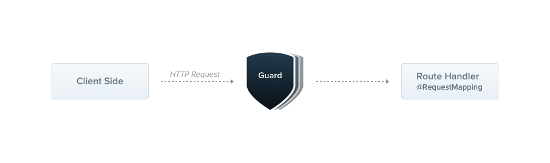
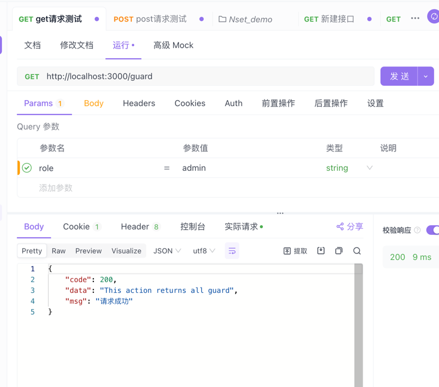
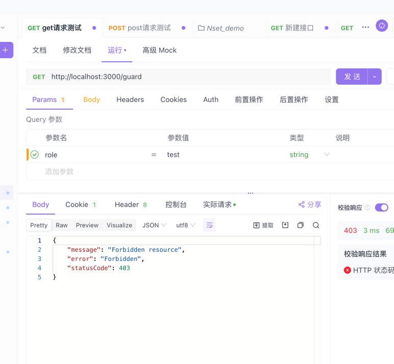

## 概述
守卫是一个使用 @Injectable() 装饰器的类。 守卫应该实现 CanActivate 接口。



守卫有一个单独的责任。它们根据运行时出现的某些条件（例如权限，角色，访问控制列表等）来确定给定的请求是否由路由处理程序处理。这通常称为授权。在传统的 Express 应用程序中，通常由中间件处理授权(以及认证)。中间件是身份验证的良好选择，因为诸如 token 验证或添加属性到 request 对象上与特定路由(及其元数据)没有强关联。

> **守卫在每个中间件之后执行，但在任何拦截器或管道之前执行。**


通过nest -- help 查看快捷生成命令
```shell
nest --help

# 生成对应guard模块
nest g res guard

# 生成模块守卫文件
nest g gu role
```
文件目录
```text
- src 
  -guard
   -role
    -role.guard.ts
   -guard.controller.ts
   -guard.module.ts
   -guard.service.ts
```
## 授权守卫

### 局部守卫
- role.guard.ts
```typescript
import { CanActivate, ExecutionContext, Injectable } from '@nestjs/common';
import { Observable } from 'rxjs';

@Injectable()
export class RoleGuard implements CanActivate {
  canActivate(
    context: ExecutionContext,
  ): boolean | Promise<boolean> | Observable<boolean> {
    console.log('RoleGuard 经过了守卫!');
    return true;
  }
}
```
### 全局守卫
- src/common/global.guard.ts
```typescript
import { CanActivate, ExecutionContext, Injectable } from '@nestjs/common';
import { Observable } from 'rxjs';

@Injectable()
export class GlobalGuard implements CanActivate {
  canActivate(
    context: ExecutionContext,
  ): boolean | Promise<boolean> | Observable<boolean> {
    console.log('经过了全局守卫!');
    return true;
  }
}
```

## 绑定守卫

### 局部守卫
- guard.controller.ts
```typescript
import { Controller, UseGuards, Get } from '@nestjs/common';
import { GuardService } from './guard.service';
import { RoleGuard } from './role/role.guard';

@Controller('guard')
@UseGuards(RoleGuard)  // 注册局部守卫
export class GuardController {
    constructor( private readonly guardService: GuardService) {}
    
    @Get()
    findAll() {
        return '调用成功！'
    }
    
}
```

### 全局守卫
- main.ts
```typescript
// 引入全局守卫
import { GlobalGuard } from './common/global.guard';

// 注册全局守卫
app.useGlobalGuards(new GlobalGuard());
```
### 智能守卫
当前RoleGuard现在虽然能正常工作，但是还不是智能的，没有利用到守卫重要的特征，**执行上下文**
它不知道角色，或者每个处理程序都允许那个角色进行操作，某些方法只允许特定的角色进行操作

nset提供了一个专属的方法来进行处理 「 @SetMetadata() 」

> SetMetadata 从nest核心包「 @nestjs/common导入 」

- guard.controller.ts
```typescript
import { Controller, UseGuards, Get, SetMetadata } from '@nestjs/common';
import { GuardService } from './guard.service';
import { RoleGuard } from './role/role.guard';

@Controller('guard')
@UseGuards(RoleGuard)
export class GuardController {
    
    @Get()
    @SetMetadata('admin', ['admin'])
    findAll() {
        return '调用成功！'
    }
    
}
```
- role.guard.ts
```typescript
import { CanActivate, ExecutionContext, Injectable } from '@nestjs/common';
import { Observable } from 'rxjs';
import { Reflector } from '@nestjs/core';
import type { Request } from 'express';

@Injectable()
export class RoleGuard implements CanActivate {
  constructor(private reflector: Reflector) {}
  canActivate(
    context: ExecutionContext,
  ): boolean | Promise<boolean> | Observable<boolean> {
      /**
       * 使用 Reflector 从当前处理程序中获取名为 'admin' 的元数据
       * 该元数据预期是一个字符串数组
       * @param 'admin' - 元数据的键名
       * @param context.getHandler() - 当前执行的处理程序
       */
      const reflector = this.reflector.get<string[]>(
          'admin',
          context.getHandler(),
      );
      /**
       * 从执行上下文中切换到 HTTP 上下文，并获取当前的 HTTP 请求对象
       * 这里假设使用的是 Express 框架，因此请求对象类型为 Request
       */
      const request = context.switchToHttp().getRequest<Request>();
      /**
       * 检查是否存在 'admin' 元数据，并且请求查询参数中的 'role' 不在元数据列表中
       * 如果满足条件，则表示当前用户的角色不符合要求，返回 false 拒绝访问
       */
      if (reflector && !reflector.includes(request.query.role as string)) {
          return false;
      }
      /**
       * 如果不满足上述条件，则表示当前用户的角色符合要求，返回 true 允许访问
       */
      return true;
  }
}
```
- 匹配成功



- 匹配失败



> 其背后的原理是，当守卫返回 false 时，框架会抛出一个 ForbiddenException 异常。如果您想要返回不同的错误响应，你应该抛出一个你自己的准确声明的异常。

> 由守卫引发的任何异常都将由异常层(全局异常过滤器和应用于当前上下文的任何异常过滤器)处理。


