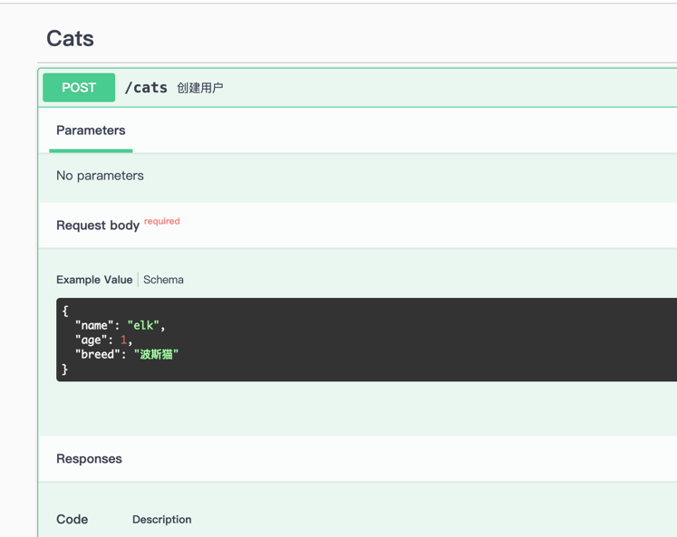

## 概述
swagger用于给前端提供接口文档

### 应用插件
```shell
npm install  @nestjs/swagger swagger-ui-express

# v10 nestjs
npm install  @nestjs/swagger@8.1.1 swagger-ui-express@4.6.3
```

> 这边安装的时候有个小坑，写这篇文章时nestjs已经是v11了，我当时用的是v10系列
> 我在安装的时候直接安装的是 @nestjs/swagger「11」 swagger-ui-express「5」，
> 然后我在引用的时候会报错，后续用的是 @nestjs/swagger「8」 swagger-ui-express「4」才正常
## 注册
- main.ts
```typescript
import { NestFactory } from '@nestjs/core';
import { SwaggerModule, DocumentBuilder } from '@nestjs/swagger';
import { ApplicationModule } from './app.module';

async function bootstrap() {    
    const app = await NestFactory.create(ApplicationModule);
    // swagger 配置
    const options = new DocumentBuilder()
        .setTitle('NestJs dmeo接口文档')       // 标题
        .setDescription('NestJs demo接口文档') // 描述
        .setVersion('1.0')                   // 版本
        .addTag('NestJs demo Tag')           // 分组
        .build();
    
    const document = SwaggerModule.createDocument(app, options);
    SwaggerModule.setup('api', app, document);

    await app.listen(3000);
}
bootstrap();
```
## 访问

http://localhost:3000/api#/ 


## ApiTags 分组
为模块创建分组：默认按文件进行分组，可配置为中文
- user.controller.ts
```typescript
import { ApiTag } from '@nestjs/Swagger';

@Controller('user')
@ApiTag('用户模块')
export class UserController { ... }
```


## ApiOperation 接口描述

```typescript
import { ApiTags, ApiOperation } from '@nestjs/swagger';
@Controller('user')
@ApiTags('用户模块')
export class UserController {
    @Get()
    @ApiOperation({
        summary: '获取验证码',  // 接口标题
        description: '获取验证码的描述' // 接口描述
    })
    getCode(){}
    
    @Post()
    @ApiOperation({
        summary: '登录'
    })
    login() {}
}
```


## ApiParam 动态参数描述
```typescript
@Get(':id')
@ApiOperation({ summary: '获取单个用户' })
@ApiParam({ name: 'id', description: '用户id', required: true })
findOne(@Param('id') id: string) {
    return this.catsService.findOne(+id);
}
```


## ApiQuery 修饰get
```typescript
@ApiQuery({ name: 'name', description: '用户名', required: false })
```


## ApiProperty 定义Post
Post请求结合dto
```typescript
import { ApiProperty } from '@nestjs/swagger';
export class CreateCatDto {
  @ApiProperty({ description: '用户名', required: true, example: 'elk' })
  name: string;
  @ApiProperty({ description: '年龄', required: true, example: 1 })
  age: number;
  @ApiProperty({ description: '品种', required: true, example: '波斯猫' })
  breed: string;
}

```




## ApiResponse 自定义返回信息
```typescript
@ApiResponse({
    status: 403,
    description: '成功自定义返回',
  })
```


## ApiBearerAuth  jwt token 

- main.ts
```typescript
const options = new DocumentBuilder()
    .addBearerAuth()  // 验证
    .setTitle('NestJs dmeo接口文档')
    .setDescription('NestJs demo接口文档')
    .setVersion('1.0')
    .addTag('NestJs demo Tag')
    .build();
```
- xxx.controller.ts
```typescript
import { ApiBearerAuth } from '@nestjs/swagger';

@Controller('cats')
@ApiBearerAuth()
export class CatsController { }
```


> **当然也有 @ApiOAuth2() 、@ApiCookieAuth()等验证**

## ApiConsumes() 文件上传
@ApiBody 装饰器和 @ApiConsumes() 结合使用
```typescript
@Post('album')
@ApiOperation({ summary: '上传文件', description: '上传文件接口' })
@UseInterceptors(FileInterceptor('file'))
@ApiConsumes('multipart/form-data')
@ApiBody({
description: '上传文件',
type: FileUploadDto,
required: true,
})
UploadFile(@UploadedFile() file: Express.Multer.File) {
    console.log('获取当前文件: ', file);
    return '上传了，成功不成功不知道！';
}
```
- dto文件
```typescript
import { ApiProperty } from '@nestjs/swagger';
export class FileUploadDto {
  @ApiProperty({ type: 'string', format: 'binary' })
  file: Express.Multer.File;
}
```


## 其他装饰器


