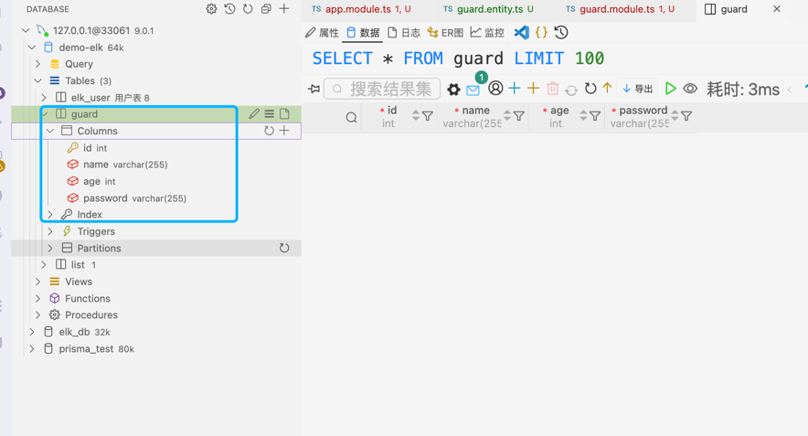

## 概述
Nest 与数据库无关，允许您轻松地与任何 SQL 或 NoSQL 数据库集成。

目前企业用的最多的是数据库是mysql，这篇文章演示连接mysql

mysql的具体安装保姆级流程可自行搜索，网上很多

## ORM框架
### TypeORM集成
官方说：Nest 使用TypeORM是因为它是 TypeScript 中最成熟的对象关系映射器( ORM )。因为它是用 TypeScript 编写的，所以可以很好地与 Nest 框架集成。
### 插件安装
```shell
npm install --save @nestjs/typeorm typeorm mysql2
```

## 连接数据库
###  1.将ORM导入到app.module.ts中
```typescript
import { Module, NestModule, MiddlewareConsumer } from '@nestjs/common';
// 引入 typeorm ORM框架
import { TypeOrmModule } from '@nestjs/typeorm';
@Module({
  imports: [
    /**
     * 使用 TypeOrmModule 的 forRoot 方法配置 TypeORM 数据库连接
     * 此配置用于连接到 MySQL 数据库，并设置相关的连接参数
     */
    TypeOrmModule.forRoot({
      // 数据库类型，这里指定为 MySQL
      type: 'mysql',
      // 数据库主机地址，这里使用本地主机
      host: 'localhost',
      // 数据库端口号，MySQL 默认端口为 3306
      port: 3306,
      // 数据库用户名
      username: 'root',
      // 数据库密码
      password: '123456',
      // 要连接的数据库名称
      database: 'nest',
      // 重试连接数据库的次数（默认：10）
      retryAttempts: 10,
      // 重试连接数据库的间隔时间（以毫秒为单位，默认：3000）
      retryDelay: 3000,
      // 实体文件的路径，使用通配符匹配所有 .entity.ts 或 .entity.js 文件
      // entities: [__dirname + '/**/*.entity{.ts,.js}'],
      // 是否自动同步数据库表结构，开发环境可设为 true，生产环境建议设为 false
      synchronize: true,
      // 是否自动加载实体，默认为 true
      autoLoadEntities: true,
      // 是否在控制台输出数据库查询日志，开发环境可设为 true，生产环境建议设为 false
      logging: true,
    }),
  ],
  controllers: [AppController],
  providers: [AppService],
})
```
### 2.定义实体

xxx.entities.ts
```typescript
/**
 * 导入 typeorm 库中的 Entity, PrimaryGeneratedColumn 和 Column 装饰器
 * Entity 用于将类标记为数据库实体
 * PrimaryGeneratedColumn 用于自动生成主键列
 * Column 用于定义数据库表中的列
 */
import { Entity, PrimaryGeneratedColumn, Column } from 'typeorm';

/**
 * 使用 @Entity 装饰器将 Guard 类标记为一个数据库实体
 * 这意味着该类将对应数据库中的一张表
 */
@Entity()
export class Guard {
  /**
   * 使用 @PrimaryGeneratedColumn 装饰器定义一个自增的主键列
   * id 是一个数字类型的字段，用于唯一标识每一条记录
   */
  @PrimaryGeneratedColumn()
  id: number;
  /**
   * 使用 @Column 装饰器定义一个名为 name 的数据库列
   * name 是一个字符串类型的字段，用于存储 Guard 的名称
   */
  @Column()
  name: string;
  /**
   * 使用 @Column 装饰器定义一个名为 age 的数据库列
   * age 是一个数字类型的字段，用于存储 Guard 的年龄
   */
  @Column()
  age: number;
  /**
   * 使用 @Column 装饰器定义一个名为 password 的数据库列
   * password 是一个字符串类型的字段，用于存储 Guard 的密码
   */
  @Column()
  password: string;
}
```
### 3.注入识别实体

xxx.module.ts
```typescript
import { Module } from '@nestjs/common';
import { Guard } from './entities/guard.entity';
import { TypeOrmModule } from '@nestjs/typeorm';

@Module({
    /**
     * 导入 TypeOrmModule 中的 forFeature 方法，用于注册当前模块需要使用的实体。
     * 在这个例子中，我们将 Guard 实体注册到当前模块中，
     * 这样 NestJS 就知道在处理与 Guard 相关的数据库操作时应该使用哪个实体。
     */
    imports: [TypeOrmModule.forFeature([Guard])],
    controllers: [GuardController],
    providers: [GuardService],
})
export class GuardModule {}
```
>  配置TypeOrmModule 的 forRoot 方法时设置了autoLoadEntities: true，自动加载实体，
> 此时就会帮我们自动创建一个表名为guard的表里面有对应的实体类



## 实体
实体是一个映射到数据库表的类。 你可以通过定义一个新类来创建一个实体，并用@Entity()来标记

```typescript
import { Entity, PrimaryGeneratedColumn, Column } from 'typeorm';

@Entity()
export class Guard {
  @PrimaryGeneratedColumn()
  id: number;

  @Column()
  name: string;

  @Column()
  age: number;

  @Column()
  password: string;
}

```
### 主列
#### 自动递增的列
```typescript
@PrimaryGeneratedColumn()
id: number;
```
#### 自动递增uuid
```typescript
@PrimaryGeneratedColumn("uuid")
id:number
```
### 列类型
```typescript
@Column({type:"varchar",length:200})
password: string

@Column({ type: "int"})
age: number

@CreateDateColumn({type:"timestamp"})
create_time:Date
```
#### mysql中的所有类型
```text
int, tinyint, smallint, mediumint, bigint, float, double, dec, 
decimal, numeric, date, datetime, timestamp, time, year, char,
varchar, nvarchar, text, tinytext, mediumtext, blob, longtext, 
tinyblob, mediumblob, longblob, enum, json, binary, geometry,
point, linestring, polygon, multipoint, multilinestring, multipolygon,
geometrycollection
```
### 自动生成列
```typescript
@Generated('uuid')
uuid:string
```
### 枚举列
```typescript
@Column({
    type:"enum",
    enum:['0','1'],
    default:'0',
})
sex:string
```
### 列选项
```typescript
@Column({
    type:"varchar",
    name:"ipaaa", //数据库表中的列名
    nullable:true, //在数据库中使列NULL或NOT NULL。 默认情况下，列是nullable：false
    comment:"注释",
    select:true,  //定义在进行查询时是否默认隐藏此列。 设置为false时，列数据不会显示标准查询。 默认情况下，列是select：true
    default:"xxxx", //加数据库级列的DEFAULT值
    primary:false, //将列标记为主要列。 使用方式和@ PrimaryColumn相同。
    update:true, //指示"save"操作是否更新列值。如果为false，则只能在第一次插入对象时编写该值。 默认值为"true"
    collation:"", //定义列排序规则。
})
ip:string
```
ColumnOptions中可用选项列表：

* type: ColumnType - 列类型。其中之一在上面.
* name: string - 数据库表中的列名。

默认情况下，列名称是从属性的名称生成的。 你也可以通过指定自己的名称来更改它。

* length: number - 列类型的长度。 例如，如果要创建varchar（150）类型，请指定列类型和长度选项。
* width: number - 列类型的显示范围。 仅用于MySQL integer types
* onUpdate: string - ON UPDATE触发器。 仅用于 MySQL.
* nullable: boolean - 在数据库中使列NULL或NOT NULL。 默认情况下，列是nullable：false。
* update: boolean - 指示"save"操作是否更新列值。如果为false，则只能在第一次插入对象时编写该值。 默认值为"true"。
* select: boolean - 定义在进行查询时是否默认隐藏此列。 设置为false时，列数据不会显示标准查询。 默认情况下，列是select：true
* default: string - 添加数据库级列的DEFAULT值。
* primary: boolean - 将列标记为主要列。 使用方式和@ PrimaryColumn相同。
* unique: boolean - 将列标记为唯一列（创建唯一约束）。
* comment: string - 数据库列备注，并非所有数据库类型都支持。
* precision: number - 十进制（精确数字）列的精度（仅适用于十进制列），这是为值存储的最大位数。仅用于某些列类型。
* scale: number - 十进制（精确数字）列的比例（仅适用于十进制列），表示小数点右侧的位数，且不得大于精度。 仅用于某些列类型。
* zerofill: boolean - 将ZEROFILL属性设置为数字列。 仅在 MySQL 中使用。 如果是true，MySQL 会自动将UNSIGNED属性添加到此列。
* unsigned: boolean - 将UNSIGNED属性设置为数字列。 仅在 MySQL 中使用。
* charset: string - 定义列字符集。 并非所有数据库类型都支持。
* collation: string - 定义列排序规则。
* enum: string[]|AnyEnum - 在enum列类型中使用，以指定允许的枚举值列表。 你也可以指定数组或指定枚举类。
* asExpression: string - 生成的列表达式。 仅在MySQL中使用。
* generatedType: "VIRTUAL"|"STORED" - 生成的列类型。 仅在MySQL中使用。
* hstoreType: "object"|"string" -返回HSTORE列类型。 以字符串或对象的形式返回值。 仅在Postgres>)中使用。
* array: boolean - 用于可以是数组的 postgres 列类型（例如 int []）
* transformer: { from(value: DatabaseType): EntityType, to(value: EntityType): DatabaseType } - 用于将任意类型EntityType的属性编组为数据库支持的类型DatabaseType。

注意：大多数列选项都是特定于 RDBMS 的，并且在MongoDB中不可用。
### 特殊列类型

#### simple-array
它可以将原始数组值存储在单个字符串列中。 所有值都以逗号分隔。
```typescript
@Entity()
export class User {
    @PrimaryGeneratedColumn()
    id: number;

    @Column("simple-array")
    names: string[];
}
```
```typescript
const user = new User();
user.names = ["Alexander", "Alex", "Sasha", "Shurik"];
```
存储在单个数据库列中的Alexander，Alex，Sasha，Shurik值。 当你从数据库加载数据时，name 将作为 names 数组返回，就像之前存储它们一样。

注意不能在值里面有任何逗号。

#### simple-json
它可以存储任何可以通过 JSON.stringify 存储在数据库中的值。 当你的数据库中没有 json 类型而你又想存储和加载对象，该类型就很有用了。

```typescript
@Entity()
export class User {
    @PrimaryGeneratedColumn()
    id: number;

    @Column("simple-json")
    profile: { name: string; nickname: string };
}
```
```typescript
const user = new User();
user.profile = { name: "John", nickname: "Malkovich" };
```
存储在单个数据库列中的{“name”：“John”，“nickname”：“Malkovich”}值 当你从数据库加载数据时，将通过 JSON.parse 返回 object/array/primitive。
