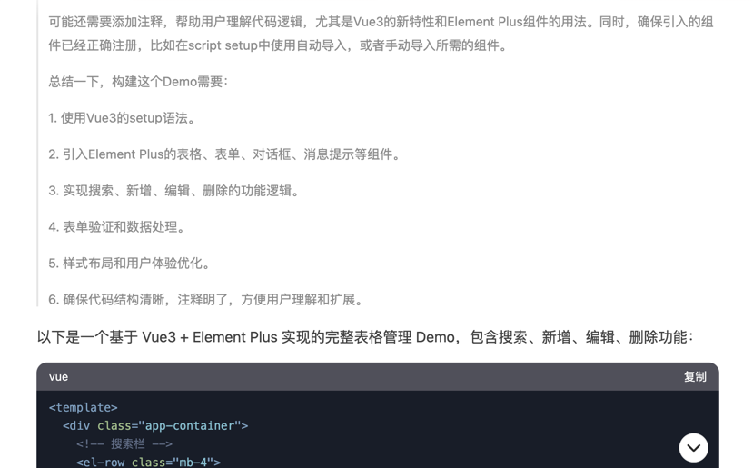
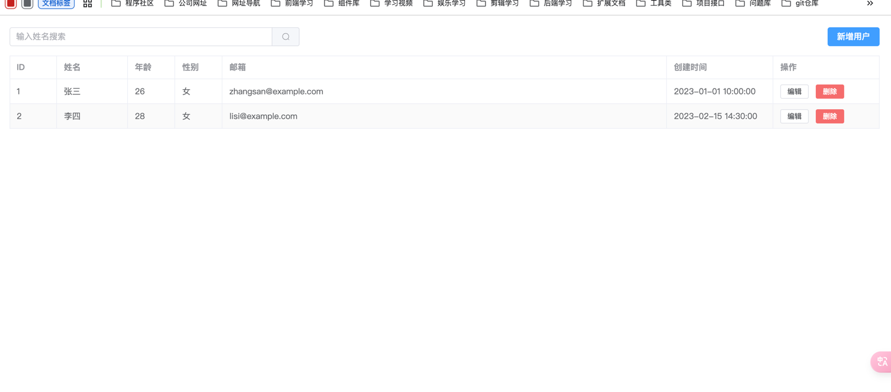
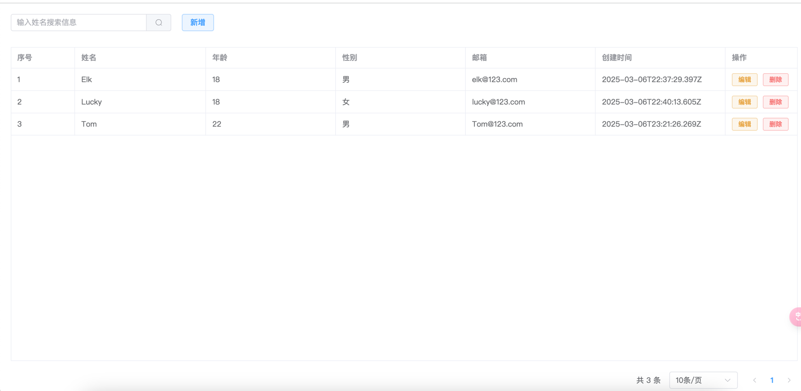
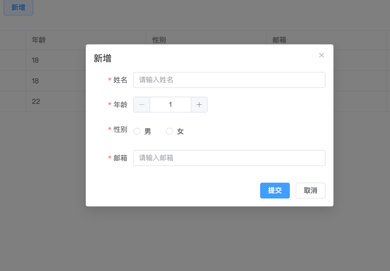

## 概述
nestjs的基本概念都学完了，现在着手做一个练习demo吧，就拿tableList来练手，一个简单的CRUD小demo

 - **前端： vue3 + ElementPlus 「基于vite构建」**
 - **后端： Nestjs + Mysql + TypeORM**

> 在此之前关于前端的界面搭建；用了最新的deepseek帮我生成，功能都有，交互也有，界面看着也挺好看，后端nest代码也能生成，真是牛哇！！！
> 不过还是自己手动实践吧，连的也是思维思路






## 前端搭建
一个简单tableList，实现基本的CRUD功能，用户和后端进行交互

- api.ts
```typescript
import axios from "axios";
const baseUrl = "/api/table";
export interface Iform {
	id: number;
	name: string;
	age: number;
	sex: string;
	emile: string;
	createTime: string;
}
export const getList = (data: object) => {
	return axios.get(baseUrl + "/getList", { params: data }).then((res) => res.data.data);
};
export const createForm = (form: Iform) => {
	return axios.post(baseUrl + "/createForm", form).then((res) => res.data);
};
export const updateForm = (id: number, form: Iform) => {
	return axios.patch(baseUrl + "/updateForm/" + id, form).then((res) => res.data);
};
export const deleteForm = (id: number) => {
	return axios.delete(baseUrl + "/deleteForm/" + id).then((res) => res.data);
};

```

- home.vue

```vue
<template>
  <div class="app-container">
    <!-- 搜索框、新增按钮 -->
    <el-input
        style="width: 300px"
        v-model="searchKey"
        placeholder="输入姓名搜索信息"
        clearable
        @clear="handleSearch"
        @keyup.enter="handleSearch"
    >
      <template #append>
        <el-button @click="handleSearch" :icon="Search" />
      </template>
    </el-input>
    <el-button type="primary" style="margin-left: 20px" @click="handleForm" plain>新增</el-button>
    <!-- 表格列表展示  -->
    <el-table :data="tableData" border style="width: 100%; margin-top: 30px; height: 80vh">
      <el-table-column type="index" label="序号" width="120"> </el-table-column>
      <el-table-column prop="name" label="姓名"> </el-table-column>
      <el-table-column prop="age" label="年龄"> </el-table-column>
      <el-table-column prop="sex" label="性别">
        <template #default="{ row }">
          {{ row.sex === "0" ? "男" : "女" }}
        </template>
      </el-table-column>
      <el-table-column prop="emile" label="邮箱"> </el-table-column>
      <el-table-column prop="createTime" label="创建时间"> </el-table-column>
      <el-table-column label="操作" width="135" fixed="right">
        <template #default="{ row }">
          <el-button type="warning" size="small" @click="handleEdit(row)" plain>编辑</el-button>
          <el-button type="danger" size="small" style="margin-left: 10px" @click="handleRemove(row)" plain
          >删除</el-button
          >
        </template>
      </el-table-column>
    </el-table>
    <!-- 表格分页 -->
    <el-config-provider :locale="zhCn">
      <el-pagination
          style="float: right; margin-top: 20px"
          v-model:current-page="params.page"
          v-model:page-size="params.pageSize"
          :page-sizes="[1, 10, 20, 50, 100]"
          :size="params.pageSize"
          layout="total,sizes, prev, pager, next"
          :total="total"
          @size-change="handleSizeChange"
          @current-change="handleCurrentChange"
      >
      </el-pagination>
    </el-config-provider>
    <!-- 表单操作 -->
    <el-dialog v-model="dialogVisible" :title="dialogTitle" width="500">
      <el-form ref="formRef" :model="form" :rules="formRules" label-width="80px">
        <el-form-item label="姓名" prop="name">
          <el-input v-model="form.name" placeholder="请输入姓名"></el-input>
        </el-form-item>
        <el-form-item label="年龄" prop="age">
          <el-input-number :min="1" :max="120" v-model="form.age" />
        </el-form-item>
        <el-form-item label="性别" prop="sex">
          <el-radio-group v-model="form.sex">
            <el-radio value="0" size="large">男</el-radio>
            <el-radio value="1" size="large">女</el-radio>
          </el-radio-group>
        </el-form-item>
        <el-form-item label="邮箱" prop="emile">
          <el-input v-model="form.emile" placeholder="请输入邮箱"></el-input>
        </el-form-item>
      </el-form>
      <template #footer>
        <el-button type="primary" :loading="btnLoading" @click="submitForm">提交</el-button>
        <el-button @click="clearDialog">取消</el-button>
      </template>
    </el-dialog>
  </div>
</template>

<script setup lang="ts">
import zhCn from 'element-plus/dist/locale/zh-cn.mjs'
import { ref, reactive, getCurrentInstance } from "vue";
import type { ComponentInternalInstance } from "@vue/runtime-core";
import { Search } from "@element-plus/icons-vue";

import type { Iform } from "./api";
import { createForm, getList, updateForm, deleteForm } from "./api";

const { proxy } = getCurrentInstance() as ComponentInternalInstance;
// 搜索输入内容
const searchKey = ref<string>();
const btnLoading = ref<boolean>(false);
// 表单弹窗
const dialogVisible = ref<boolean>(false);
const dialogTitle = ref<string>("新增");
const formRef = ref();

const total = ref<number>(0);
// 查询条件
const params = ref({
  keyWord: "",
  page: 1,
  pageSize: 10,
});

// 表单数据
const form = ref<Iform>({
  id: null!,
  name: "",
  age: 0,
  sex: "",
  emile: "",
  createTime: "",
});
// 表单验证规则
const formRules = reactive({
  name: [{ required: true, message: "请输入姓名", trigger: "blur" }],
  age: [{ required: true, message: "请输入年龄", trigger: "blur" }],
  sex: [{ required: true, message: "请选择性别", trigger: "change" }],
  emile: [
    { required: true, message: "请输入邮箱", trigger: "blur" },
    { type: "emile", message: "请输入正确的邮箱格式", trigger: "blur" },
  ],
});
const handleSizeChange = (val: number) => {
  params.value.pageSize = val;
  init();
};
const handleCurrentChange = (val: number) => {
  params.value.page = val;
  init();
};

// 表格数据
const tableData = ref<Iform[]>([]);

// 初始化获取表格数据
const init = async () => {
  const res = await getList(params.value);
  tableData.value = res.data;
  total.value = res.total;
};
init();
// 搜索内容
const handleSearch = () => {
  params.value.keyWord = searchKey.value!;
  init();
};

// 重置表单
const resetForm = () => {
  formRef.value?.resetFields();
  Object.assign(form.value, {
    id: null,
    name: null,
    age: null,
    sex: null,
    emile: null,
  });
};
// 表单弹窗关闭
const clearDialog = () => {
  dialogVisible.value = false;
  resetForm();
};
// 新增弹窗
const handleForm = () => {
  dialogVisible.value = true;
  dialogTitle.value = "新增";
};

// 编辑弹窗
const handleEdit = (row: Iform) => {
  console.log("🚀 ~ handleEdit ~ row:", row);
  dialogVisible.value = true;
  dialogTitle.value = "编辑";
  Object.assign(form.value, row);
};

// 提交表单
const submitForm = async () => {
  await formRef.value.validate(async (valid: boolean) => {
    if (!valid) return;
    btnLoading.value = true;
    if (dialogTitle.value === "编辑") {
      // 更新逻辑
      await updateForm(form.value.id, form.value);
      proxy.$message({
        type: "success",
        message: "修改成功",
      });
    } else {
      // 新增逻辑
      await createForm(form.value);
      proxy.$message({
        type: "success",
        message: "新增成功",
      });
    }
    init();
    btnLoading.value = false;
    clearDialog();
  });
};

// 删除指定数据
const handleRemove = (row: Iform) => {
  proxy
      .$confirm("确定删除吗？", "警告", {
        confirmButtonText: "删除",
        cancelButtonText: "取消",
        type: "error",
      })
      .then(async () => {
        await deleteForm(row.id);
        init();
        proxy.$message({
          type: "success",
          message: "删除成功!",
        });
      })
      .catch(() => {
        console.log("取消删除");
      });
};
</script>

<style>
.app-container {
  padding: 20px;
}
</style>
```





## 后端服务

```shell
# 新增tableList CRUD模版
nest g res tableList
```

### DTO文件
```typescript
// 定义一个名为 CreateTableListDto 的类，用于创建 TableList 实体的数据传输对象（DTO）。
import { ApiProperty } from '@nestjs/swagger';
export class CreateTableListDto {
  @ApiProperty({ description: 'id', required: false })
  id: number;
  @ApiProperty({ description: '姓名', required: true })
  name: string;
  @ApiProperty({ description: '年龄', required: true })
  age: number;
  @ApiProperty({ description: '性别', required: true })
  sex: string;
  @ApiProperty({ description: '邮箱', required: true })
  emile: string;
}
```
### 实体文件

- /entities/table-list.entity.ts
```typescript
import {
  Entity,
  Column,
  PrimaryGeneratedColumn,
  CreateDateColumn,
} from 'typeorm';
@Entity()
export class TableList {
  @PrimaryGeneratedColumn()
  id: number;
  @Column()
  name: string;
  @Column()
  age: number;
  @Column()
  sex: string;
  @Column()
  emile: string;
  @CreateDateColumn()
  createTime: Date;
}
```
### Module文件
```typescript
import { Module } from '@nestjs/common';
import { TableListService } from './table-list.service';
import { TableListController } from './table-list.controller';

import { TypeOrmModule } from '@nestjs/typeorm';
import { TableList } from './entities/table-list.entity';

@Module({
    /**
     * 使用 TypeOrmModule 的 forFeature 方法来注册 TableList 实体。
     * 这使得当前模块可以使用 TypeORM 来处理 TableList 实体的数据库操作。
     * forFeature 方法接收一个实体数组作为参数，这里只传入了 TableList 实体。
     */
    imports: [TypeOrmModule.forFeature([TableList])],

    controllers: [TableListController],
    providers: [TableListService],
})
export class TableListModule {}
```
### controller文件
```typescript
import {
  Controller,
  Get,
  Post,
  Body,
  Query,
  Patch,
  Param,
  Delete,
} from '@nestjs/common';
import { TableListService } from './table-list.service';
import { CreateTableListDto } from './dto/create-table-list.dto';
import { UpdateTableListDto } from './dto/update-table-list.dto';

import {
  ApiTags,
  ApiOperation,
  ApiQuery,
  ApiBody,
  ApiParam,
} from '@nestjs/swagger';

@Controller('table')
@ApiTags('表格list-demo')
export class TableListController {
  constructor(private readonly tableListService: TableListService) {}

  @Post('/createForm')
  @ApiOperation({ summary: '创建表单' })
  create(@Body() createTableListDto: CreateTableListDto) {
    return this.tableListService.create(createTableListDto);
  }

  @Get('/getList')
  @ApiOperation({ summary: '获取列表' })
  @ApiQuery({
    name: 'keyWord',
    required: false,
    description: '关键字',
    default: '',
  })
  @ApiQuery({ name: 'page', required: false, description: '页码', default: 1 })
  @ApiQuery({
    name: 'pageSize',
    required: false,
    description: '每页数量',
    default: 10,
  })
  findAll(@Query() query: { keyWord: string; page: number; pageSize: number }) {
    return this.tableListService.findAll(query);
  }

  @Patch('/updateForm/:id')
  @ApiOperation({ summary: '更新表单' })
  @ApiParam({ name: 'id', required: true, description: '表单id' })
  @ApiBody({ type: UpdateTableListDto })
  update(
    @Param('id') id: string,
    @Body() updateTableListDto: UpdateTableListDto,
  ) {
    return this.tableListService.update(+id, updateTableListDto);
  }

  @Delete('/deleteForm/:id')
  @ApiOperation({ summary: '删除表单' })
  @ApiParam({ name: 'id', required: true, description: '表单id' })
  remove(@Param('id') id: string) {
    return this.tableListService.remove(+id);
  }
}
```

### service文件
```typescript
import { Injectable } from '@nestjs/common';
import { CreateTableListDto } from './dto/create-table-list.dto';
import { UpdateTableListDto } from './dto/update-table-list.dto';

import { TableList } from './entities/table-list.entity';
import { Repository, Like } from 'typeorm';
import { InjectRepository } from '@nestjs/typeorm';

@Injectable()
export class TableListService {
    /**
     * 构造函数，用于初始化 TableListService 类的实例。
     *
     * @param tableListRepository - 用于操作 TableList 实体的 TypeORM 存储库。
     * 通过 @InjectRepository 装饰器注入，确保在服务中可以使用该存储库进行数据库操作。
     */
  constructor(
    @InjectRepository(TableList)
    private readonly tableListRepository: Repository<TableList>,
  ) {}
  create(createTableListDto: CreateTableListDto) {
    const tableList = new TableList();
    tableList.name = createTableListDto.name;
    tableList.age = createTableListDto.age;
    tableList.sex = createTableListDto.sex;
    tableList.emile = createTableListDto.emile;
    return this.tableListRepository.save(tableList);
  }

  async findAll(query: { keyWord: string; page: number; pageSize: number }) {
    const data = await this.tableListRepository.find({
      where: {
        name: Like(`%${query.keyWord}%`),
      },
      skip: (query.page - 1) * query.pageSize,
      take: query.pageSize,
    });
    const total = await this.tableListRepository.count({
      where: {
        name: Like(`%${query.keyWord}%`),
      },
    });
    return { data, total };
  }

  update(id: number, updateTableListDto: UpdateTableListDto) {
    return this.tableListRepository.update(id, updateTableListDto);
  }

  remove(id: number) {
    return this.tableListRepository.delete(id);
  }
}

```
