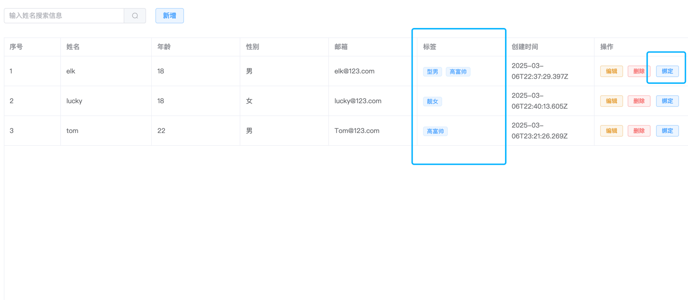
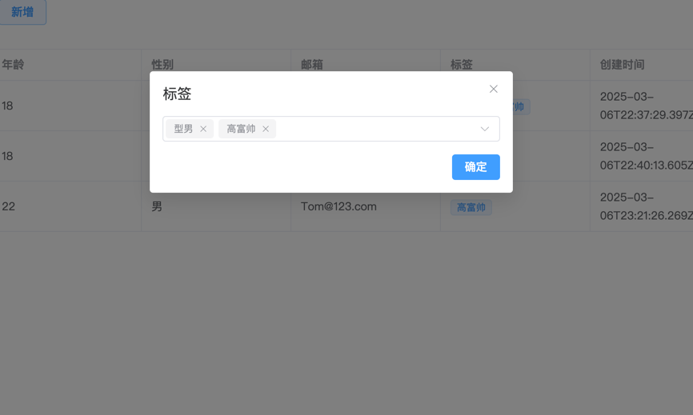

## 概述

关系是指两个或多个表之间的联系。关系基于每个表中的常规字段，通常包含主键和外键。

关系有三种：

* 一对一：主表中的每一行在外部表中有且仅有一个对应行。使用@OneToOne()装饰器来定义这种类型的关系
* 一对多/多对一：主表中的每一行在外部表中有一个或多的对应行。使用@OneToMany()和@ManyToOne()装饰器来定义这种类型的关系
* 多对多：主表中的每一行在外部表中有多个对应行，外部表中的每个记录在主表中也有多个行。使用@ManyToMany()装饰器来定义这种类型的关系

## 案例
沿用上一章的例子，新增了一个标签列，用于展示绑定的标签





### 前端

- api.ts

新增了一个createTags API方法用于绑定用户标签
```typescript
import axios from "axios";
const baseUrl = "/api/table";
export interface Itag {
    id: number;
    name: string;
    createTime: string;
}
export interface Iform {
	id: number;
	name: string;
	age: number;
	sex: string;
	emile: string;
	createTime: string;
    tags?: Itag[];
}

export const getList = (data: object) => {
	return axios.get(baseUrl + "/getList", { params: data }).then((res) => res.data.data);
};
export const createForm = (form: Iform) => {
	return axios.post(baseUrl + "/createForm", form).then((res) => res.data);
};
export const updateForm = (id: number, form: Iform) => {
	return axios.patch(baseUrl + "/updateForm/" + id, form).then((res) => res.data);
};
export const deleteForm = (id: number) => {
	return axios.delete(baseUrl + "/deleteForm/" + id).then((res) => res.data);
};

export const createTags = (data: object) => {
	return axios.post(baseUrl + "/createTags", data).then((res) => res.data);
};
```

- home.vue

列表新增标签页，以及操作新增绑定按钮和对应的方法以及弹窗，用于新增标签和展示标签
```vue
<template>
	<div class="app-container">
		<!-- 搜索框、新增按钮 -->
		<el-input
			style="width: 300px"
			v-model="searchKey"
			placeholder="输入姓名搜索信息"
			clearable
			@clear="handleSearch"
			@keyup.enter="handleSearch"
		>
			<template #append>
				<el-button @click="handleSearch" :icon="Search" />
			</template>
		</el-input>
		<el-button type="primary" style="margin-left: 20px" @click="handleForm" plain>新增</el-button>
		<!-- 表格列表展示  -->
		<el-table :data="tableData" border style="width: 100%; margin-top: 30px; height: 80vh">
			<el-table-column type="index" label="序号" width="120"> </el-table-column>
			<el-table-column prop="name" label="姓名"> </el-table-column>
			<el-table-column prop="age" label="年龄"> </el-table-column>
			<el-table-column prop="sex" label="性别">
				<template #default="{ row }">
					{{ row.sex === "0" ? "男" : "女" }}
				</template>
			</el-table-column>
			<el-table-column prop="emile" label="邮箱"> </el-table-column>
			<el-table-column prop="tags" label="标签">
				<template #default="{ row }">
					<el-tag style="margin-right: 8px" v-for="item in row.tags" :key="item" size="small">{{
						item.name
					}}</el-tag>
				</template>
			</el-table-column>
			<el-table-column prop="createTime" label="创建时间"> </el-table-column>
			<el-table-column label="操作" width="225" fixed="right">
				<template #default="{ row }">
					<el-button type="warning" size="small" @click="handleEdit(row)" plain>编辑</el-button>
					<el-button type="danger" size="small" style="margin-left: 10px" @click="handleRemove(row)" plain
						>删除</el-button
					>
					<el-button type="primary" size="small" @click="handleTags(row)" plain>绑定</el-button>
				</template>
			</el-table-column>
		</el-table>
		<!-- 表格分页 -->
		<el-config-provider :locale="zhCn">
			<el-pagination
				style="float: right; margin-top: 20px"
				v-model:current-page="params.page"
				v-model:page-size="params.pageSize"
				:page-sizes="[1, 10, 20, 50, 100]"
				:size="params.pageSize"
				layout="total,sizes, prev, pager, next"
				:total="total"
				@size-change="handleSizeChange"
				@current-change="handleCurrentChange"
			>
			</el-pagination>
		</el-config-provider>
		<!-- 表单操作 -->
		<el-dialog v-model="dialogVisible" :title="dialogTitle" width="500">
			<el-form ref="formRef" :model="form" :rules="formRules" label-width="80px">
				<el-form-item label="姓名" prop="name">
					<el-input v-model="form.name" placeholder="请输入姓名"></el-input>
				</el-form-item>
				<el-form-item label="年龄" prop="age">
					<el-input-number :min="1" :max="120" v-model="form.age" />
				</el-form-item>
				<el-form-item label="性别" prop="sex">
					<el-radio-group v-model="form.sex">
						<el-radio value="0" size="large">男</el-radio>
						<el-radio value="1" size="large">女</el-radio>
					</el-radio-group>
				</el-form-item>
				<el-form-item label="邮箱" prop="emile">
					<el-input v-model="form.emile" placeholder="请输入邮箱"></el-input>
				</el-form-item>
			</el-form>
			<template #footer>
				<el-button type="primary" :loading="btnLoading" @click="submitForm">提交</el-button>
				<el-button @click="clearDialog">取消</el-button>
			</template>
		</el-dialog>
		<el-dialog v-model="dialogVisibleTag" title="标签" width="30%">
			<el-select v-model="tags" multiple placeholder="请选择标签">
				<el-option label="型男" value="型男"></el-option>
				<el-option label="靓女" value="靓女"></el-option>
				<el-option label="高富帅" value="高富帅"></el-option>
				<el-option label="白富美" value="白富美"></el-option>
			</el-select>
			<template #footer>
				<el-button type="primary" @click="submitTags">确定</el-button>
			</template>
		</el-dialog>
	</div>
</template>

<script setup lang="ts">
import zhCn from "element-plus/dist/locale/zh-cn.mjs";
import { ref, reactive, getCurrentInstance } from "vue";
import type { ComponentInternalInstance } from "@vue/runtime-core";
import { Search } from "@element-plus/icons-vue";

import type { Iform, Itag } from "./api";
import { createForm, getList, updateForm, deleteForm, createTags } from "./api";

const { proxy } = getCurrentInstance() as ComponentInternalInstance;
// 搜索输入内容
const searchKey = ref<string>();
const btnLoading = ref<boolean>(false);
// 表单弹窗
const dialogVisible = ref<boolean>(false);
const dialogTitle = ref<string>("新增");
const formRef = ref();
// 标签
const dialogVisibleTag = ref<boolean>(false);
const tags = ref<string[]>([]);

const total = ref<number>(0);
// 查询条件
const params = ref({
	keyWord: "",
	page: 1,
	pageSize: 10,
});

// 表单数据
const form = ref<Iform>({
	id: null!,
	name: "",
	age: 0,
	sex: "",
	emile: "",
	createTime: "",
});
// 表单验证规则
const formRules = reactive({
	name: [{ required: true, message: "请输入姓名", trigger: "blur" }],
	age: [{ required: true, message: "请输入年龄", trigger: "blur" }],
	sex: [{ required: true, message: "请选择性别", trigger: "change" }],
	emile: [
		{ required: true, message: "请输入邮箱", trigger: "blur" },
		{ type: "emile", message: "请输入正确的邮箱格式", trigger: "blur" },
	],
});
const handleSizeChange = (val: number) => {
	params.value.pageSize = val;
	init();
};
const handleCurrentChange = (val: number) => {
	params.value.page = val;
	init();
};

// 表格数据
const tableData = ref<Iform[]>([]);

// 初始化获取表格数据
const init = async () => {
	const res = await getList(params.value);
	tableData.value = res.data;
	total.value = res.total;
};
init();
// 搜索内容
const handleSearch = () => {
	params.value.keyWord = searchKey.value! || "";
	init();
};

// 重置表单
const resetForm = () => {
	formRef.value?.resetFields();
	Object.assign(form.value, {
		id: null,
		name: null,
		age: null,
		sex: null,
		emile: null,
	});
};
// 表单弹窗关闭
const clearDialog = () => {
	dialogVisible.value = false;
	resetForm();
};
// 新增弹窗
const handleForm = () => {
	dialogVisible.value = true;
	dialogTitle.value = "新增";
    resetForm();
};

// 编辑弹窗
const handleEdit = (row: Iform) => {
	dialogVisible.value = true;
	dialogTitle.value = "编辑";
	Object.assign(form.value, row);
};

// 提交表单
const submitForm = async () => {
	try {
		dialogVisibleTag.value = false;
		await formRef.value.validate(async (valid: boolean) => {
			if (!valid) return;
			btnLoading.value = true;
			if (dialogTitle.value === "编辑") {
                delete form.value.tags
				// 更新逻辑
				await updateForm(form.value.id, form.value);
				proxy.$message({
					type: "success",
					message: "修改成功",
				});
			} else {
				// 新增逻辑
				await createForm(form.value);
				proxy.$message({
					type: "success",
					message: "新增成功",
				});
			}
			init();
			btnLoading.value = false;
			clearDialog();
		});
	} catch (error) {
        btnLoading.value = false;
		console.log("🚀 ~ submitForm ~ error:", error);
        proxy.$message({
            type: "error",
            message: "新增失败",
        });
	}
};

// 删除指定数据
const handleRemove = (row: Iform) => {
	proxy
		.$confirm("确定删除吗？", "警告", {
			confirmButtonText: "删除",
			cancelButtonText: "取消",
			type: "error",
		})
		.then(async () => {
			await deleteForm(row.id);
			init();
			proxy.$message({
				type: "success",
				message: "删除成功!",
			});
		})
		.catch(() => {
			console.log("取消删除");
		});
};

// 打开标签
const handleTags = (row: Iform) => {
	dialogVisibleTag.value = true;
	Object.assign(form.value, row);
	let tagsArr: string[] = [];
	if (row.tags) {
		row.tags.forEach((item: Itag) => {
			tagsArr.push(item.name);
		});
		tags.value = tagsArr;
	} else {
		tags.value = [];
	}
};
const submitTags = async () => {
	await createTags({
		userId: form.value.id,
		tags: tags.value,
	});
	dialogVisibleTag.value = false;
	tags.value = [];
	init();
};
</script>

<style>
.app-container {
	padding: 20px;
}
</style>
```

### 后端

### 实体文件
新增了一个tags.entity.ts文件

- /table-list/entitites/tags.entity.ts

```typescript
import {
  Entity,
  PrimaryGeneratedColumn,
  Column,
  CreateDateColumn,
  ManyToOne,
  JoinColumn,
} from 'typeorm';
import { TableList } from './table-list.entity';

/**
 * TagsEntity 类表示一个数据库实体，用于存储标签信息。
 * 该类使用 TypeORM 装饰器来定义实体的结构和关系。
 */
@Entity()
export class TagsEntity {
  /**
   * 主键列，自动生成唯一的 ID。
   */
  @PrimaryGeneratedColumn()
  id: number;

  /**
   * 标签的名称。
   */
  @Column()
  name: string;

  /**
   * 标签的创建时间，自动记录创建时的日期和时间。
   */
  @CreateDateColumn()
  createTime: Date;

  /**
   * 定义与 TableList 实体的多对一关系。
   * 多个标签可以关联到一个 TableList 记录。
   * @param () => TableList - 指向关联的实体类型。
   * @param (tableList) => tableList.tags - 指向关联实体中反向关系的属性。
   */
  @ManyToOne(() => TableList, (tableList) => tableList.tags)
  /**
   * 定义外键关联列，用于建立与 TableList 实体的关联。
   */
  @JoinColumn()
  userId: TableList;
}
```

- /entities/table-list.entity.ts

```typescript
import {
  Entity,
  Column,
  PrimaryGeneratedColumn,
  CreateDateColumn,
  OneToMany,
} from 'typeorm';
import { TagsEntity } from './tags.entity';

@Entity()
export class TableList {
  @PrimaryGeneratedColumn()
  id: number;
  @Column()
  name: string;
  @Column()
  age: number;
  @Column()
  sex: string;
  @Column()
  emile: string;
  @CreateDateColumn()
  createTime: Date;

  /**
   * 定义与 TagsEntity 实体的一对多关系。
   * 一个 TableList 记录可以关联多个 TagsEntity 记录。
   * @param () => TagsEntity - 指向关联的实体类型。
   * @param (tagsEntity) => tagsEntity.userId - 指向关联实体中反向关系的属性。
   */
  @OneToMany(() => TagsEntity, (tagsEntity) => tagsEntity.userId)
  // 定义一个 tags 属性，类型为 TagsEntity 数组，用于存储关联的标签实体
  tags: TagsEntity[];
}
```

### Module文件

引入tags的实体，注册实体「TagsEntity」

```typescript
import { Module } from '@nestjs/common';
import { TableListService } from './table-list.service';
import { TableListController } from './table-list.controller';

import { TypeOrmModule } from '@nestjs/typeorm';
import { TableList } from './entities/table-list.entity';
import { TagsEntity } from './entities/tags.entity'

@Module({
  /**
   * 使用 TypeOrmModule 的 forFeature 方法来注册 TableList 实体。
   * 这使得当前模块可以使用 TypeORM 来处理 TableList 实体的数据库操作。
   * forFeature 方法接收一个实体数组作为参数，这里传入了 TableList、TagsEntity 实体。
   */
  imports: [TypeOrmModule.forFeature([TableList, TagsEntity])],

  controllers: [TableListController],
  providers: [TableListService],
})
export class TableListModule {}
```

### Controller文件

新增了一个Post createTags方法用于创建标签

```typescript
import {
  Controller,
  Get,
  Post,
  Body,
  Query,
  Patch,
  Param,
  Delete,
} from '@nestjs/common';
import { TableListService } from './table-list.service';
import { CreateTableListDto } from './dto/create-table-list.dto';
import { UpdateTableListDto } from './dto/update-table-list.dto';

import {
  ApiTags,
  ApiOperation,
  ApiQuery,
  ApiBody,
  ApiParam,
} from '@nestjs/swagger';

@Controller('table')
@ApiTags('表格list-demo')
export class TableListController {
  constructor(private readonly tableListService: TableListService) {}

  @Post('/createForm')
  @ApiOperation({ summary: '创建表单' })
  create(@Body() createTableListDto: CreateTableListDto) {
    return this.tableListService.create(createTableListDto);
  }

  @Post('/createTags')
  @ApiOperation({ summary: '创建标签' })
  createTags(@Body() parasm: { userId: number; tags: string[] }) {
    return this.tableListService.createTags(parasm);
  }

  @Get('/getList')
  @ApiOperation({ summary: '获取列表' })
  @ApiQuery({
    name: 'keyWord',
    required: false,
    description: '关键字',
    default: '',
  })
  @ApiQuery({ name: 'page', required: false, description: '页码', default: 1 })
  @ApiQuery({
    name: 'pageSize',
    required: false,
    description: '每页数量',
    default: 10,
  })
  findAll(@Query() query: { keyWord: string; page: number; pageSize: number }) {
    return this.tableListService.findAll(query);
  }

  @Patch('/updateForm/:id')
  @ApiOperation({ summary: '更新表单' })
  @ApiParam({ name: 'id', required: true, description: '表单id' })
  @ApiBody({ type: UpdateTableListDto })
  update(
    @Param('id') id: string,
    @Body() updateTableListDto: UpdateTableListDto,
  ) {
    return this.tableListService.update(+id, updateTableListDto);
  }

  @Delete('/deleteForm/:id')
  @ApiOperation({ summary: '删除表单' })
  @ApiParam({ name: 'id', required: true, description: '表单id' })
  remove(@Param('id') id: string) {
    return this.tableListService.remove(+id);
  }
}
```

### Service文件

构造函数初始化 tagsEntity类的实例，用于操作存储库


新增createTags方法

```typescript
import { Injectable } from '@nestjs/common';
import { CreateTableListDto } from './dto/create-table-list.dto';
import { UpdateTableListDto } from './dto/update-table-list.dto';

import { TableList } from './entities/table-list.entity';
import { TagsEntity } from './entities/tags.entity';
import { Repository, Like } from 'typeorm';
import { InjectRepository } from '@nestjs/typeorm';

@Injectable()
export class TableListService {
  /**
   * 构造函数，用于初始化 TableListService 类的实例。
   *
   * @param tableListRepository - 用于操作 TableList 实体的 TypeORM 存储库。
   * 通过 @InjectRepository 装饰器注入，确保在服务中可以使用该存储库进行数据库操作。
   */
  constructor(
    @InjectRepository(TableList)
    private readonly tableListRepository: Repository<TableList>,
    @InjectRepository(TagsEntity)
    private readonly tagsEntity: Repository<TagsEntity>,
  ) {}
  create(createTableListDto: CreateTableListDto) {
    const tableList = new TableList();
    tableList.name = createTableListDto.name;
    tableList.age = createTableListDto.age;
    tableList.sex = createTableListDto.sex;
    tableList.emile = createTableListDto.emile;
    return this.tableListRepository.save(tableList);
  }

  //通过前端传入的userId 查到当前id 的用户信息，然后拿到前端传入的tags [tag1,tag2,tag3]
  // 进行遍历 给tag实例进行赋值 然后调用保存方法添加tag 添加完之后 通过 tagList 保存该tag类
  // 最后把tagList 赋给 user类的tags属性 然后重新调用save 进行更新
  async createTags({ userId, tags }: { userId: number; tags: string[] }) {
    const userInfo = await this.tableListRepository.findOne({
      where: { id: userId },
    });
    const tagList = [];
    for (let i = 0; i < tags.length; i++) {
      const tag = new TagsEntity();
      tag.name = tags[i];
      await this.tagsEntity.save(tag);
      tagList.push(tag);
    }
    userInfo.tags = tagList;
    return this.tableListRepository.save(userInfo);
  }

  async findAll(query: { keyWord: string; page: number; pageSize: number }) {
    const data = await this.tableListRepository.find({
      relations: ['tags'],
      where: {
        name: Like(`%${query.keyWord}%`),
      },
      skip: (query.page - 1) * query.pageSize,
      take: query.pageSize,
    });
    const total = await this.tableListRepository.count({
      where: {
        name: Like(`%${query.keyWord}%`),
      },
    });
    return { data, total };
  }

  update(id: number, updateTableListDto: UpdateTableListDto) {
    return this.tableListRepository.update(id, updateTableListDto);
  }

  remove(id: number) {
    return this.tableListRepository.delete(id);
  }
}

```


> findAll方法「getList」：this.tableListRepository.find 新增一个 relations: ['tags]，用于联合查询

> 注意：联合查询之后，当我们在修改数据的时候，提交的from表单会多一个tags属性，此时
> 后端修改方法中是直接使用的this.tableListRepository.update方法，这个只针对于当前「tableListRepository」实体
> 有效，如果设计到tags联合查询就会报错，此时前端在提交编辑的时候进行了删除tags属性，这样才正常
