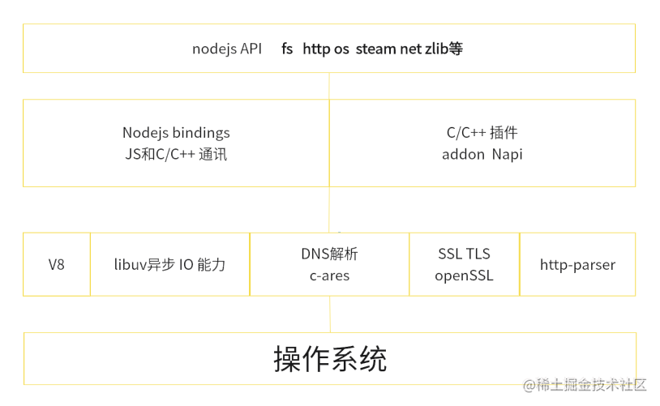

## 概述
1. Nodejs并不是JavaScript应用，也不是编程语言，因为编程语言使用的JavaScript,Nodejs是 JavaScript的运行时
2. Nodejs是构建在V8引擎之上的，V8引擎是由C/C++编写的，因此我们的JavaSCript代码需要由C/C++转化后再执行。
3. NodeJs 使用异步 I/O 和事件驱动的设计理念，可以高效地处理大量并发请求，提供了非阻塞式 I/O 接口和事件循环机制，使得开发人员可以编写高性能、可扩展的应用程序,异步I/O最终都是由libuv 事件循环库去实现的.
4. NodeJs 使用npm 作为包管理工具类似于python的pip，或者是java的Maven，目前npm拥有上百万个模块。
   https://www.npmjs.com/
5. Nodejs适合干一些IO密集型应用，不适合CPU密集型应用，nodejsIO依靠libuv有很强的处理能力，而CPU因为nodejs单线程原因，容易造成CPU占用率高，如果非要做CPU密集型应用，可以使用C++插件编写 或者nodejs提供的cluster。(CPU密集型指的是图像的处理 或者音频处理需要大量数据结构 + 算法)
## 架构图

## 应用场景

### 前端
Vue、React、Angular、Nuxtjs、Nextjs

### 后端
serverLess

web应用 epxress Nestjs koa

RPC 服务 gRPC

爬虫 Puppeteer cheerio

BFF层 网关层

及时性应用socket.io

### 桌前端
electron

tauri

NWjs

### 移动端
weex

ionic

hybrid

React Native

### 基建端
webpack vite rollup gulp

less scss postCss

babel swc

inquire command  shelljs

### 嵌入式
Ruff js

### 单元测试
jest vitest e2e

### CICD
Jenkins docker  Husky   miniprogram-ci

### 反向代理
http-proxy Any-proxy
