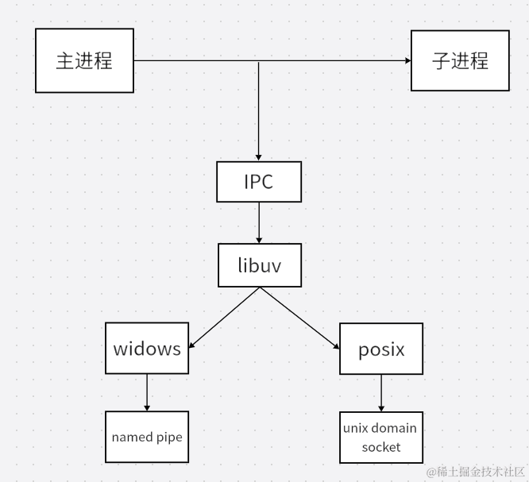

## 概述
child_process是nodejs中核心的模块
```javascript
const childProcess = require("node:child_process")
```
## 创建子进程的方法
> 含有7个方法，4个异步，三个同步
> 
> 异步：exec，execFile，spawn，fork
> 
> 同步：execSync，execFileSync，spawnSync

### exec
执行一些简单的shell命令，有返回的大小限制，返回的是一个流
> exec(cmd,options,callback)
> 
> cmd: 要执行的命令
> 
> options: 配置项
> 
> callback：回调函数
>
```javascript
const { exec } = require("node:child_process")
exec("node -v",(err,stdout,stderr) => {
    if(err) {
        return err;
    }
    console.log("🚀 ~ stdout:", stdout.toString()); // v20.11.0
})
```
### execSync
同步执行shell命令
> execSync(cmd,options)
> 
> cmd: 要执行的命令
> 
> options: 配置项
```javascript
const nodeVersion = execSync("node -v");
// execSync("start chrome http://www.baidu.com");           // windows
execSync("open -a 'Google Chrome' http://www.baidu.com");   // macos
console.log("🚀 ~ nodeVersion:", nodeVersion.toString())
```

### execFile
执行可执行文件「只针对于js文件」
> execFile(file, [,args],[,options],callback)
> 
> file: 要运行的可执行文件的名称或路径
> 
> args: 字符串参数列表
> 
> options: 选项对象
> 
> callback: 回调函数
```javascript
const textPath = path.resolve(__dirname, "./bat.sh");
const textPath = path.resolve(process.cwd(),"./bat.sh")
console.log("🚀 ~ textPath:", textPath);
execFile(textPath, null, (err, stdout, stderr) => {
	if (err) {
		console.log("🚀 ~ execFile ~ err:", err)
		return err;
	}
	console.log("🚀 ~ execFile ~ stdout:", stdout.toString());
});
```

### spawn
> spawn(cmd,[,args],[,options])
> 
> cmd: 要执行的命令
> 
> args: 命令的参数
> 
> options: 命令的选项
> 
> spawn 用于执行一些实时获取的信息因为spawn返回的是流边执行边返回，exec是返回一个完整的buffer，buffer的大小是200k，如果超出会报错，而spawn是无上限的。
>
> pawn在执行完成后会抛出close事件监听，并返回状态码，通过状态码可以知道子进程是否顺利执行。exec只能通过返回的buffer去识别完成状态，识别起来较为麻烦
>
> exec是底层通过execFile实现 execFile底层通过spawn实现
```javascript
const {stdout} = spawn('netstat',['-an'],{})
// 返回的数据用data事件接受
stdout.on('data',(steram)=>{
    console.log(steram.toString())
})
const bat = spawn("./bat.sh");
bat.stdout.on('data',data => {
    console.log("🚀 ~ stdout data:", data.toString())
})
bat.stderr.on('data', data => {
    console.log("🚀 ~ stderr data:",data.toString())
})
bat.on('close', code => {
    console.log("🚀 ~ close code:",code)
})
```

### fork
场景适合大量的计算，或者容易阻塞主进程操作的一些代码
> fork(modulePath,[,args],[,options])
> 
> modulePath: 要在子进程运行的模块
> 
> args: 字符串参数列表
> 
> options: 子进程的配置选项
>
```javascript
// 父： index.js
//  send 发送信息  message: 父进程向子进程发送的消息,可以相互发送接收
const childProcess = fork('./child.js');

// 给子进程发送信息
childProcess.send("我是主进程");

// 接收子进程发送的信息
childProcess.on('message',(msg)=>{
    console.log("🚀 ~ childProcess.on ~ msg:",msg)
})

// 子: child.js
// 接收子进程发送的问题
process.on("message", (data) => {
    console.log("🚀 ~ process.on ~ 子进程接受信息:", data)
})
// 向父进程发送信息
process.send("我是子进程，父进程收到了吗")
```
> **fork底层使用的是IPC通道进行通讯的**
> 

