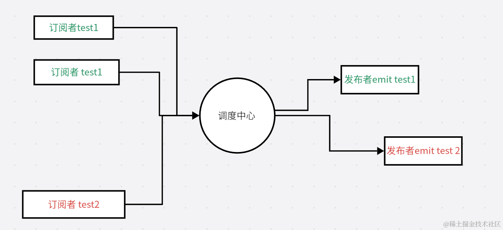

## 概述
Nodejs核心API之一：事件触发器，采用异步事件驱动架构，通过有效的方法来监听事件动态的变化
在变化的时候做出相应的动作。

## 事件模型
发布订阅者设计模式


## API
> on：监听事件
> 
> emit： 触发事件
> 
> once： 一次性监听事件「触发一次就回收」
> 
> off：取消监听事件
> 
> setMaxListeners： 设置监听器的个数，默认10个
```javascript
const EventEmitter = require("node:events");
const event = new EventEmitter();
event.on("submit", (name) => {
    console.log("🚀 ~ event.on ~ name:", name)
})
event.once("submit", (name) => {
    console.log("🚀 ~ event.once ~ name:", name)
})
// on：   输出   elk  lucky
// once： 只输出  elk 
event.emit("submit","elk");    // elk
event.emit("submit","lucky");  // lucky

const fn = (name) => {
    console.log("🚀 ~ fn", name)
}
// 有off： 无任何输出
// 无off： 输出  xm
event.on("click", fn);
event.off("click", fn);
event.emit("click","xm");  
// 监听限制
event.on("handel", fn);
event.on("handel", fn);
//.......  有15个

// 监听默认10个超出报错
event.setMaxListeners(20) // 设置上限为20个 则不报错
event.emit("handel","elk");    // elk
```
