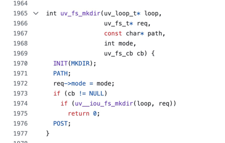

## 概述
node:fs与文件系统进行交互
## fs的多种模式
异步、同步、promise
> **注意**：API中带Sync是同步，其余是异步
```javascript
const fs = require("node:fs");
const fsPro = require("node:fs/promise");
fs.readFile()      // 异步模式
fs.readFileSync()  // 同步模式
// promise模式
fsPro.readFile().then( res => {
    ...
})
```
## 常用api

### readFile
读取文件内容
> 参数： path、[,options], callback
> 
> path: 文件路径
> 
> options: 可选，指定读取文件的编码方式，默认为buffer
> 
> callback: 回调函数，接收两个参数，err, data

> err: 错误信息
> 
> data: 返回的是一个Buffer对象
```javascript
fs.readFile('./text.txt',(err, data) => {
    if(err) return err
    console.log("🚀 ~ data:", data.toString())
})
```

### createReadStream
使用可读流读取 使用场景适合读取大文件
```javascript
const createReadStreamCont =  fs.createReadStream('./max.txt')
createReadStreamCont.on('data', (chunk) => {
    console.log("🚀 ~ chunk:", chunk.toString())
})
createReadStreamCont.on('end', () => {
    console.log("🚀 ~ createReadStreamCont.on ~ end:")
} )
```

### mkdir
创建文件
> path: 创建文件的路径
> 
> options: 可选，配置项
> 
> recursive: 默认 false  是否递归创建目录
> 
> callback: 回调函数
> 
> err: 错误的回调
> 
> path: 创建成功后的路径「recursive为true返回，其余返回undefined」 返回第一层目录
```javascript
fs.mkdir('./test/child/a.txt', {recursive: true } ,(err,  path  ) => {
    if (err) {
        console.log("🚀 ~ err:", err)
    } else {
        console.log("🚀 ~ mkdir success",path)
    }
})
```

### rm
删除文件和目录
> path: 删除文件的路径
> 
> options: 可选，配置项
> 
> force: 默认 false  当为 true 时，如果 path 不存在，则异常将被忽略
> 
> recursive: 默认值：false 如果为 true，则执行递归删除。在递归模式下，操作将在失败时重试。
>
> retryDelay: 默认值: 100 重试之间等待的时间 如果 recursive 选项不为 true，则忽略此选项。
> 
> callback: 回调函数
> 
> err: 错误的回调
> 
> 删除深层次的文件：开启 recursive为true
```javascript
fs.rm('./test/child/a.txt', { recursive: true}, (err) => {
    if(err) return err
})
```

### renameSync
重命名文件  返回undefined
> oldPath: 旧的文件路径

> newPath: 新的文件路径
```javascript
fs.renameSync('./test/child/a.txt', './test/child/b.txt')
```

### watch
监听文件的变化
> filename:  文件或目录
> 
> options: 配置项
> 
> listener： Function
>   
>   1)、eventType： 'rename' 或 'change'，filename 是触发事件的文件的名称
> 
>   2)、filename：文件或目录
```javascript
fs.watch('./max.txt', (eventType, filename) => {
    // 文件修改时： change    max.txt
    console.log(eventType, filename)
})
```
### writeFile
写入文件
>   file: 文件名或文件描述符  不存在就创建，存在覆盖内容 { flag: 'a'}  可追加内容
> 
>   data: 写入的内容
> 
>   options: 配置项
>      encoding: 默认 'utf8'
> 
>   mode: 默认 '0o666'
>      flag: 默认 'w'
> 
>    flush: 如果所有数据都成功写入文件，并且 flush 是 true，则使用 fs.fsyncSync() 来刷新数据
>
```javascript
// appendFileSync 追加内容api
fs.writeFileSync('./text.txt','测试写入的内容', {
    flag: 'a'
});
```

### createWriteStream
可写流
> path: 导入文件的路径
> 
> options: 配置项
```javascript
const verse = [
    "先帝创业未半而中道崩殂,",
    "今天下三分,",
    "益州疲弊,",
    "此诚危急存亡之秋也。"
]
let writeStream = fs.createWriteStream('./text.txt');
verse.forEach(item => {
    writeStream.write(item);
})
// 关闭
writeStream.end();
// 结束事件
writeStream.on('finish', () => {
    console.log('写入完成');
})
```
### 源码解析
地址：https://github.com/libuv/libuv/blob/v1.x/src/unix/fs.c <br/>
fs的源码是通过 C++ 层的 FSReqCallback 这个类 对libuv 的uv_fs_t 的一个封装，其实也就是将我们fs 的参数透传给 libuv 层

#### mkdir举例
```javascript
// 创建目录的异步操作函数，通过uv_fs_mkdir函数调用
// 参数：
// - loop: 事件循环对象，用于处理异步操作
// - req: 文件系统请求对象，用于保存操作的状态和结果
// - path: 要创建的目录的路径
// - mode: 目录的权限模式 777 421
// - cb: 操作完成后的回调函数
int uv_fs_mkdir(uv_loop_t* loop,
                uv_fs_t* req,
                const char* path,
                int mode,
                uv_fs_cb cb) {
  INIT(MKDIR);
  PATH;
  req->mode = mode;
  if (cb != NULL)
    if (uv__iou_fs_mkdir(loop, req))
      return 0;
  POST;
}
```
#### 注意事项
> 为什么先走setImmediate 呢，而不是fs
> 
> Node.js 读取文件的时候是使用libuv进行调度的
> 
> 而setImmediate是由V8进行调度的
> 
> 文件读取完成后 libuv 才会将 fs的结果 推入V8的队列
```javascript
const fs = require('node:fs')

fs.readFile('./index.txt', {
    encoding: 'utf-8',
    flag: 'r'
}, (err, dataStr) => {
    if (err) throw err
    console.log('fs')  // 2
})

setImmediate(() => {
    console.log('setImmediate')  // 1
})
```

## 硬链接和软链接

### 硬链接
> existingPath: 原始文件地址
> 
> newPath: 新文件地址
> 
> callback: 回调函数  返回err
```javascript
fs.link('./text.txt', './text2.txt', (err) => {
    console.log("err",err)
})
```
#### 作用和用途
**文件共享**：硬链接允许多个文件名指向同一个文件，这样可以在不同的位置使用不同的文件名引用相同的内容。这样的共享文件可以节省存储空间，并且在多个位置对文件的修改会反映在所有引用文件上。<br/>
**文件备份**：通过创建硬链接，可以在不复制文件的情况下创建文件的备份。如果原始文件发生更改，备份文件也会自动更新。这样可以节省磁盘空间，并确保备份文件与原始文件保持同步。<br/>
**文件重命名**：通过创建硬链接，可以为文件创建一个新的文件名，而无需复制或移动文件。这对于需要更改文件名但保持相同内容和属性的场景非常有用。<br/>

### 软链接
>target: 目标文件地址
> 
>path: 生成的路径
> 
>type: windows环境使用
> 
>callback: 异步回调函数

#### 作用和用途
1、软链接可以创建指向文件或目录的引用。这使得你可以在不复制或移动文件的情况下引用它们，并在不同位置使用不同的文件名访问相同的内容。<br/>
2、软链接可以用于创建快捷方式或别名，使得你可以通过一个简短或易记的路径来访问复杂或深层次的目录结构。<br/>
3、软链接可以用于解决文件或目录的位置变化问题。如果目标文件或目录被移动或重命名，只需更新软链接的目标路径即可，而不需要修改引用该文件或目录的其他代码。<br/>
