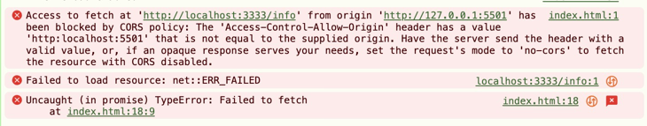
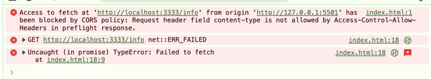
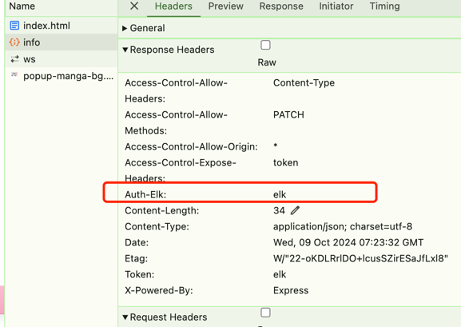
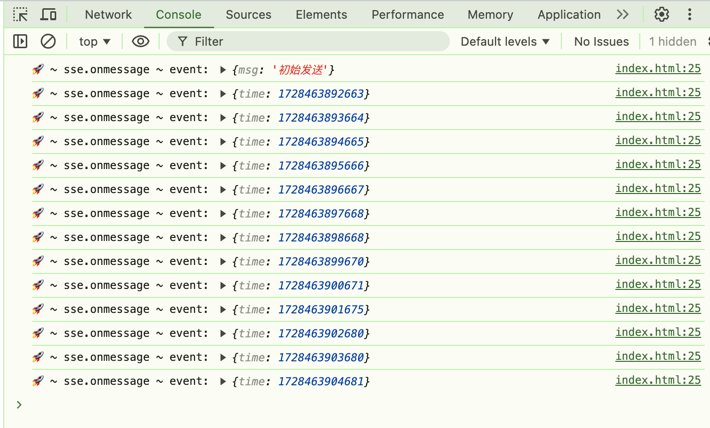

## 基本介绍
### 响应头
HTTP响应头「HTTP response headers」是在HTTP响应中发送的元数据信息，用于描述响应的特性、内容和行为。它们以键值对的形式出现，每个键值对由一个标头字段（header field）和一个相应的值组成。
> **access-control-allow-origin**: http:xxxx  用于cros，指定允许访问的域名
>
> **connection**: keep-alive    控制连接的持久性
> 
> **content-length**:  34「字节」  响应体大小    
> 
> **content-type**: application/json; charset=utf-8   响应体的MIME类型
>
> **date**:   响应时间
> 
> **etag**:  资源的特定版本的标识符，用于缓存验证
>
> **keep-alive**: timeout=5  指定超时时间和最大请求量

### 响应头和跨域
- index.html
```html
<script>
    fetch('http://localhost:3333/info').then(res => {
        return res.json()
    }).then(res => {
        console.log("res", res)
    })
</script>
```
- app.js
```javascript
import express from "express";
const app = express();

app.get('/info', (req,res) => {
    res.json({
        code: 200,
        data: '请求成功'
    })
})

app.listen(3333, () => {
    console.log("server is running at port 3333");
})
```
如何我们打开index.html，查看F12会发现这么一个错误

这是浏览器同源策略的原因，当我们的协议不同、域名不同、端口不同，只要有一个不同，浏览器就不允许访问，即使我们现在做到了协议相同、域名相同、但是端口无法做到相同，这是前后端分离的项目，无法公用一个端口
需要后端设置一下那个Access-Control-Allow-Origin属性
```javascript
app.get('/info', (req,res) => {
    // Access-Control-Allow-Origin * | origin
    //  *： 代表全部放行，但是会有安全问题，并且服务端发送的session获取不到
    // origin： 只允许请求头中的origin字段的域名，一般常用，相对安全
    // 放行
    // res.setHeader('Access-Control-Allow-Origin','*')
    res.setHeader('Access-Control-Allow-Origin','http://localhost:5501')
    res.json({
        code: 200,
        data: '请求成功'
    })
})
```
### 请求头
HTTP请求头（HTTP request headers）是客户端发送到服务器的键值对，它们提供了关于HTTP请求的附加信息。这些请求头可以被用来控制缓存、认证、内容类型、重定向、Cookies等。
> accept: 告知服务器客户端能够接收哪些类型的响应媒体类型
> 
> accept-encoding: 能接收的压缩的格式类型
> 
> accept-language: 指定客户端的偏好语音
> 
> connection: 控制是否保持连接
> 
> host: 请求服务器的域名和端口
> 
> if-none-match: 与 ETag 一起使用，用于缓存验证
> 
> origin: 指定请求源「协议+域名+端口」
> 
> referer：指定请求的来源地址url

### 额外的请求方法
服务端默认只支持 GET POST HEAD OPTIONS 请求

遵循restFui 要支持PATCH 或者其他请求
```javascript
app.use("*",(req,res,next) => {
    res.setHeader('Access-Control-Allow-Origin','http://localhost:5501');
    // 添加PATCH请求方法进入methods中,否则报错！！！！
    res.setHeader('Access-Control-Allow-Methods','PATCH')
})
// app.js
app.patch("/info", (req, res) => {
    res.json({
        code: 200
    })
})
// index.html
fetch('http://localhost:3333/info',{
    method: 'PATCH'
}).then( res => {
    return res.json()
}).then(res => {
    console.log("🚀 ~ fetch ~ res:", res)
})
```
## 预请求 OPTIONS
预检请求的主要目的是确保跨域请求的安全性 它需要满足一定条件才会触发
> **自定义请求方法**：当使用非简单请求方法（Simple Request Methods）时，例如 PUT、DELETE、CONNECT、OPTIONS、TRACE、PATCH 等，浏览器会发送预检请求。
>
> **自定义请求头部字段**：当请求包含自定义的头部字段时，浏览器会发送预检请求。自定义头部字段是指不属于简单请求头部字段列表的字段，例如 Content-Type 为 application/json、Authorization 等。
>
> **带凭证的请求**：当请求需要在跨域环境下发送和接收凭证（例如包含 cookies、HTTP 认证等凭证信息）时，浏览器会发送预检请求。

- app.js
```javascript
app.post('/info', (req, res) => {
    
    res.json({
        code: 200,
        data: 'post请求成功'
    })
})
```
- index.html
```html
<script>
    fetch("http://localhost:3333/info", {
        method: 'POST',
        headers: {
            'Content-Type': 'application/json'
        }
    }).then( res => {
        return res.json()
    }).then( res => {
        console.log("res", res)
    })
</script>
```
此时会报错，因为 application/json 不属于cors 范畴需要手动支持

```javascript
// app.js
res.setHeader('Access-Control-Allow-Headers','Content-Type')
```
## 自定义响应头
根据需求后端需要自定义响应头
- app.js
```javascript
app.get("/info", (req, res) => {
    res.set("auth-elk", 'elk');
    //后端将自定义响应头抛出，前端才能获取
    res.setHeader("Access-Control-Expose-Headers","auth-elk")
    res.json({
        code: 200,
        data: '请求成功'
    })
})
```
<br/>
前端获取
```html
<script>
    fetch("http://localhost:3333/info").then(res => {
        const headers = res.headers;
        const auth = headers.get("auth-elk") 
        // 后端需要将那个自定义头抛出，否则为null
        return res.json()
    }).then( res => {
        console.log("res", res)
    })
</script>
```
## SSE
服务器发送事件「Server-Sent Events SSE」是一种服务器主动向客户端发送消息的技术，与传统的客户端的轮询或长轮询，SSE提供了一个更高效的方式来实现服务端和客户端实时通信。

### 示例
- app.js
```javascript
app.get("/sse", (req, res) => {
    res.setHeader("Content-Type", "text/event-stream");
    res.setHeader("Cache-Control", 'no-cache');
    res.setHeader("Connection", 'keep-alive')
    // 发送初始文件
    res.write(`data: ${JSON.stringify({ msg: '初始发送' })}\n\n`);
    // 创建定时器
    const timer = setInterval(() => {
        res.write(`data: ${JSON.stringify({ time: new Date().getTime() })}\n\n`);
    }, 1000);
    // 如果连接关闭，清除定时器
    req.on('close', () => {
        clearInterval(timer);
    })
})
```
- index.html
```html
<script>
    const sse = new EventSource('http://localhost:3333/sse');
    sse.onmessage = function(event) {
        const data = JSON.parse(event.data);
        console.log("🚀 ~ sse.onmessage ~ event:", data)
    }
</script>
```

