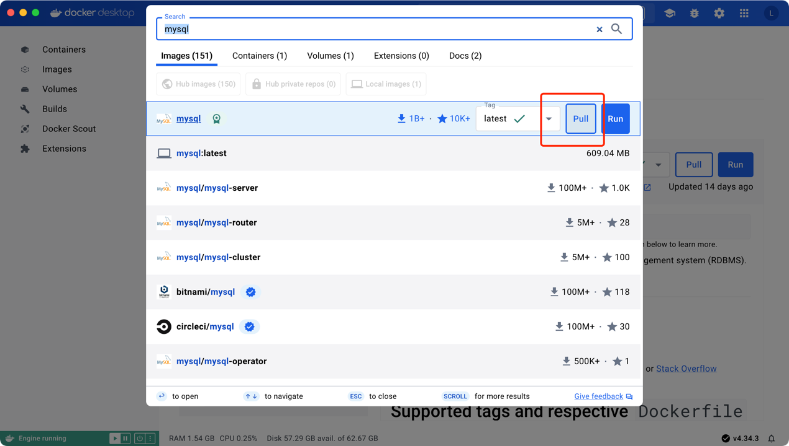

## 概述
MySql是一个广泛使用的开源关系型数据库管理系统「RDBMS」，基于SQL「Structured Query Language」

> **数据库**：MySql是一个数据库管理系统，用于创建和管理数据库。数据库是一个组织结构，用于存储和管理数据。
> 
> **表**：数据库中的数据被组织成表的形式。表由行和列组成，行表示记录，列表示字段。
> 
> **SQL**：MySQL使用结构化查询语言（SQL）进行数据库操作。SQL是一种用于定义、操作和查询数据库的语言。
>
> **数据类型**：MySQL支持各种数据类型，例如整数、浮点数、字符串、日期和时间等。每个列都有自己的数据类型。
>
> **索引**：MySQL允许创建索引以加快数据检索速度。索引是对表中一列或多列的值进行排序的数据结构。
>
> **主键**：主键是表中的唯一标识符。它用于确保表中的每个记录都有唯一的标识。
>
> **外键**：外键用于建立表与表之间的关联。它定义了一个表中的列与另一个表中的列之间的关系。
> 
> **触发器**：触发器是一种在数据库中定义的操作，它会在特定事件发生时自动执行。例如，当向表中插入新记录时，可以触发一个触发器来执行其他操作。
> 
> **存储过程**：存储过程是一组预编译的SQL语句，可以在数据库中进行重复使用。它可以接受参数并返回结果。
> 
> **备份和恢复**：MySQL提供了备份和恢复数据库的工具和命令，以确保数据的安全性和可靠性。 
## 安装
### 官方安装
www.mysql.com/  
选择对应的系统版本，一步一步确定，上网查询配置对应的环境变量即可
### docker容器安装mysql镜像
我这边用的是docker安装的mysql镜像 
官方安装Docker Desktop 「 https://www.docker.com/ 」 
安装完之后可以注册登录和选择游客登录
> 我这边搜索挂的是vpn，国内的网不稳定，大概率搜索不出来 
> 可以配置阿里云个人版镜像服务「https://registry.cn-hangzhou.aliyuncs.com
」

执行run之后，会生成一个容器

通过可视化工具进行测试连接mysql
- vscode插件「Database Client」

