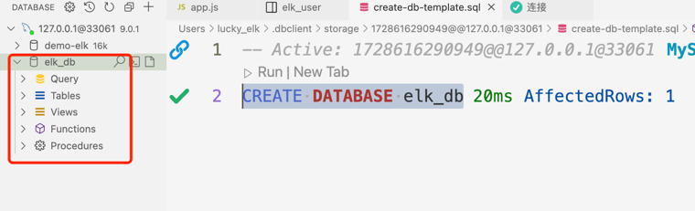
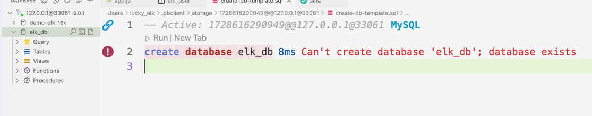

## sql语句

### 创建数据库

```sql
 CREATE DATABASE 库名
```


#### 创建重名的库问题
```sql
 CREATE DATABASE elk_db
```
> 当我们创建了这个elk_db这个表之后，再次执行这条sql语句就会报错



```sql
 CREATE DATABASE IF NOT EXISTS elk_db

-- 如果不存在就创建，如果存在就什么都不做
```
### 创建表
```sql
CREATE TABLE elk_user (  
    id int NOT NULL PRIMARY KEY AUTO_INCREMENT COMMENT '主键',
    name VARCHAR(255) DEFAULT NULL COMMENT '名称',
    age int DEFAULT NULL COMMENT '年龄',
    address VARCHAR(255) DEFAULT NULL COMMENT '地址',
    create_time TIMESTAMP DEFAULT CURRENT_TIMESTAMP COMMENT '创建时间'
) COMMENT '用户表';
```
create table 表名字 ( <br/>
    **id** 字段名称 **int** 数据类型代表数字类型 **NOT NULL**(不能为空)  **AUTO_INCREMENT**(id自增)
    **PRIMARY KEY**(id为主键) <br/>
    **name**(字段名称) **varchar(100)**字符串类型100字符 **COMMENT**(注释) <br/>
    **age**(字段名称) **int**数据类型代表数字类型  **COMMENT**(注释) <br/>
    **create_time**(字段名称) **timestamp**(时间戳) **DEFAULT CURRENT_TIMESTAMP**(自动填充创建时间)<br/>
)

#### 修改表名
```sql
ALTER TABLE elk_user RENAME elk_test;
```
#### 增加列
```sql
ALTER TABLE elk_test ADD COLUMN email VARCHAR(255) DEFAULT NULL COMMENT '邮箱'
```
#### 删除列
```sql
ALTER TABLE elk_test DROP COLUMN email
```
#### 编辑列
```sql
ALTER TABLE elk_test MODIFY COLUMN age VARCHAR(100) NULL COMMENT '年龄2'
```
