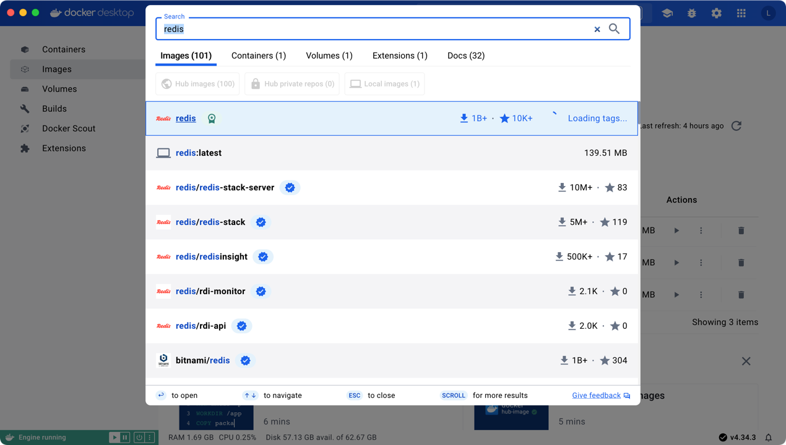
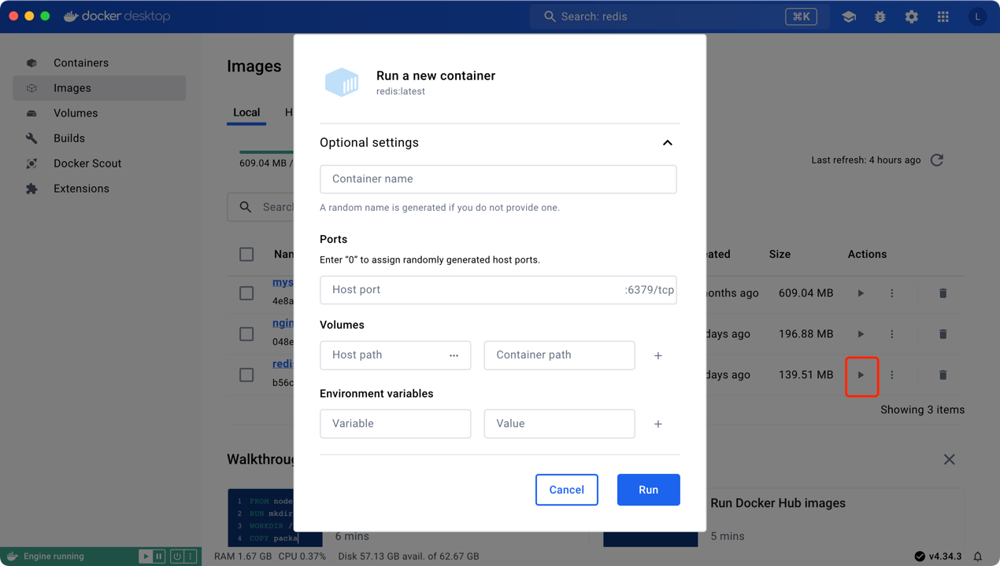
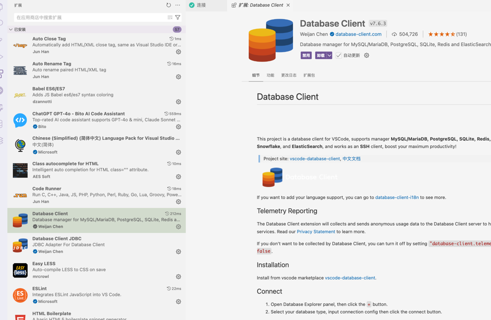
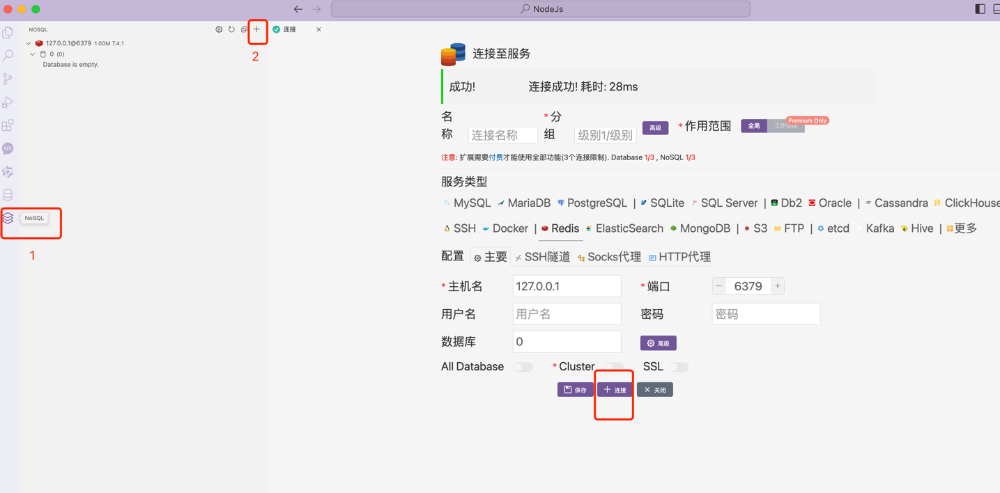
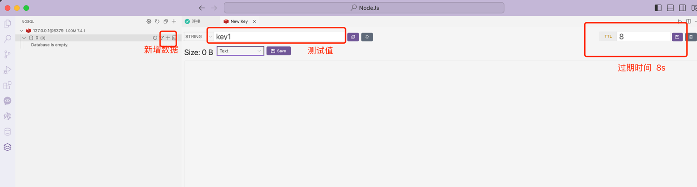

## 概述
Redis（Remote Dictionary Server）是一个开源的内存数据结构存储系统，它提供了一个高效的键值存储解决方案，并支持多种数据结构，如字符串（Strings）、哈希（Hashes）、列表（Lists）、集合（Sets）和有序集合（Sorted Sets）等。它被广泛应用于缓存、消息队列、实时统计等场景。

> **内存存储**：Redis主要将数据存储在内存中，因此具有快速的读写性能。它可以持久化数据到磁盘，以便在重新启动后恢复数据。
> 
> **多种数据结构**：Redis不仅仅是一个简单的键值存储，它支持多种数据结构，如字符串、哈希、列表、集合和有序集合。这些数据结构使得Redis能够更灵活地存储和操作数据。
> 
> **发布/订阅**：Redis支持发布/订阅模式，允许多个客户端订阅一个或多个频道，以接收实时发布的消息。这使得Redis可以用作实时消息系统。
>
> **事务支持**：Redis支持事务，可以将多个命令打包成一个原子操作执行，确保这些命令要么全部执行成功，要么全部失败。
> 
> **持久化**：Redis提供了两种持久化数据的方式：RDB（Redis Database）和AOF（Append Only File）。RDB是将数据以快照形式保存到磁盘，而AOF是将每个写操作追加到文件中。这些机制可以确保数据在意外宕机或重启后的持久性。
>
> **高可用性**：Redis支持主从复制和Sentinel哨兵机制。通过主从复制，可以创建多个Redis实例的副本，以提高读取性能和容错能力。Sentinel是一个用于监控和自动故障转移的系统，它可以在主节点宕机时自动将从节点提升为主节点。
>
> **缓存**：由于Redis具有快速的读写性能和灵活的数据结构，它被广泛用作缓存层。它可以将常用的数据存储在内存中，以加快数据访问速度，减轻后端数据库的负载。
> 
> **实时统计**：Redis的计数器和有序集合等数据结构使其非常适合实时统计场景。它可以存储和更新计数器，并对有序集合进行排名和范围查询，用于统计和排行榜功能

## 安装
官方地址： [redis.io](https://redis.io/docs/latest/operate/oss_and_stack/install/install-redis/)

支持 mac、windows、linux

我这边使用的是docker desktop 进行安装，跟之前mysql一样

搜索 redis pull， 开启一个容器，可以进行配置

## 可视化工具
vscode 搜索安装 Database Client

最后点击连接，提示成功

