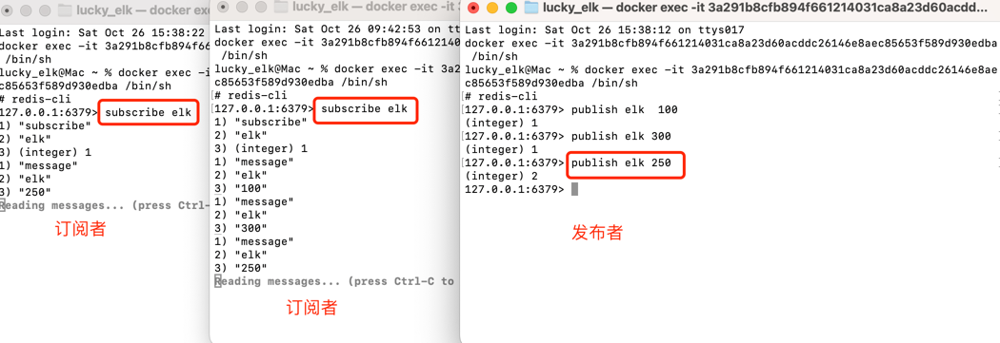
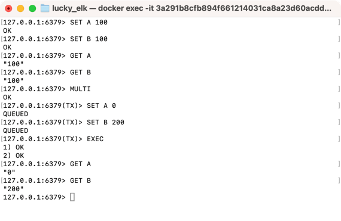

## 发布订阅
发布-订阅是一种消息传递模式，其中消息发布者（发布者）将消息发送到频道（channel），而订阅者（订阅者）可以订阅一个或多个频道以接收消息。这种模式允许消息的解耦，发布者和订阅者之间可以独立操作，不需要直接交互。

- PUBLISH命令 : 用于将消息发布到指定的频道。
- SUBSCRIBE命令 : 用于订阅一个或多个频道。
- UNSUBSCRIBE命令 : 用于取消订阅一个或多个频道。
- PSUBSCRIBE命令 : 用于模式订阅一个或多个匹配的频道。
- PUNSUBSCRIBE命令 : 用于取消模式订阅一个或多个匹配的频道。


## 事务
Redis支持事务（Transaction），它允许用户将多个命令打包在一起作为一个单元进行执行。事务提供了一种原子性操作的机制，要么所有的命令都执行成功，要么所有的命令都不执行。

Redis的事务使用MULTI、EXEC、WATCH和DISCARD等命令来管理。
- MULTI命令：用于开启一个事务。在执行MULTI命令后，Redis会将接下来的命令都添加到事务队列中，而不是立即执行。
- EXEC命令：用于执行事务中的所有命令。当执行EXEC命令时，Redis会按照事务队列中的顺序执行所有的命令。执行结果以数组的形式返回给客户端。
- WATCH命令：用于对一个或多个键进行监视。如果在事务执行之前，被监视的键被修改了，事务将被中断，不会执行。
- DISCARD命令：用于取消事务。当执行DISCARD命令时，所有在事务队列中的命令都会被清空，事务被取消。

使用事务的基本流程如下：

- 使用MULTI命令开启一个事务。
- 将需要执行的命令添加到事务队列中。
- 如果需要，使用WATCH命令监视键。
- 执行EXEC命令执行事务。Redis会按照队列中的顺序执行命令，并返回执行结果。
- 根据返回结果判断事务执行是否成功。

事务中的命令在执行之前不会立即执行，而是在执行EXEC命令时才会被执行。这意味着事务期间的命令并不会阻塞其他客户端的操作，也不会中断其他客户端对键的读写操作。
需要注意的是，Redis的事务不支持回滚操作。如果在事务执行期间发生错误，事务会继续执行，而不会回滚已执行的命令。因此，在使用Redis事务时，需要保证事务中的命令是幂等的，即多次执行命令的结果和一次执行的结果相同
```shell
# 连接redis
redis-cli

# 开启事务
MULTI

# 添加命令到队列 - 测试转账 A、B各有100，A转账给B 100
SET A 0
SET B 200

# 执行事务
EXEC
```


