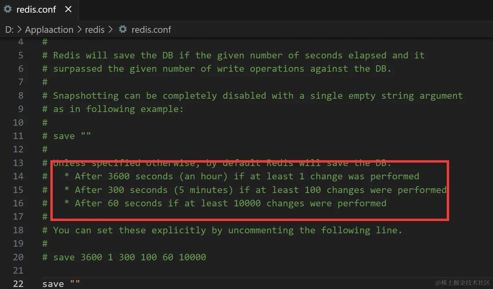
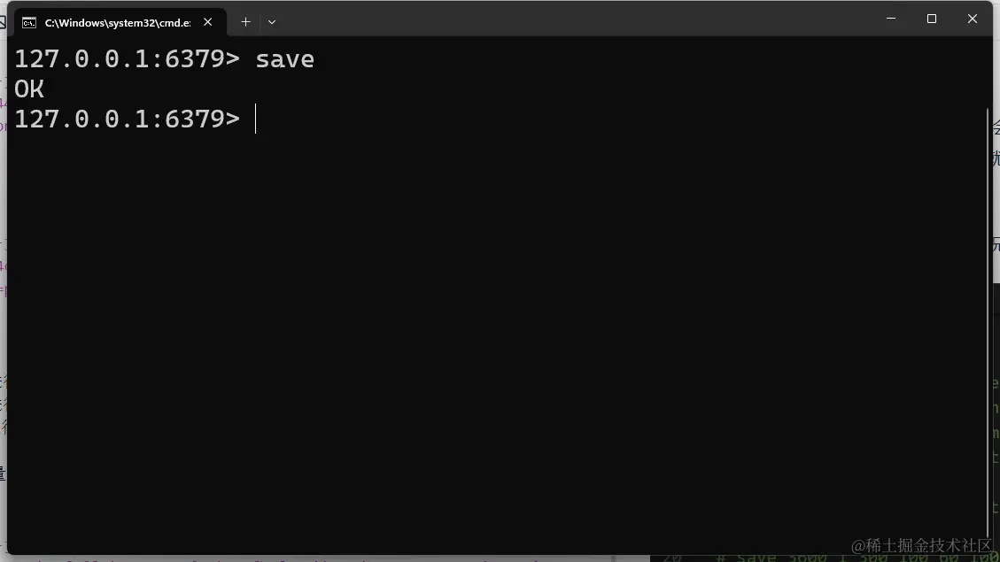
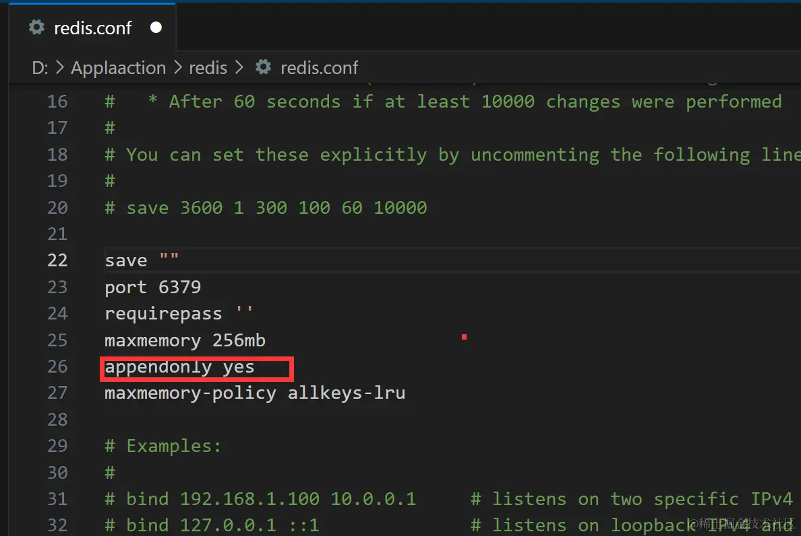
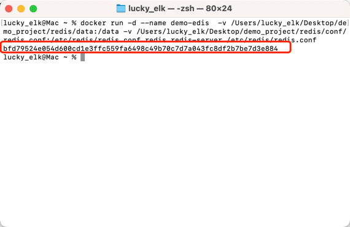
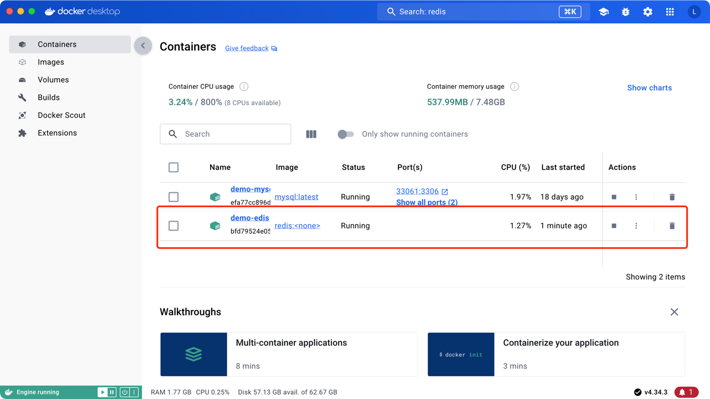

## redis持久化
Redis提供两种持久化方式：

1、RDB（Redis Database）持久化：RDB是一种快照的形式，它会将内存中的数据定期保存到磁盘上。可以通过配置Redis服务器，设置自动触发RDB快照的条件，比如在指定的时间间隔内，或者在指定的写操作次数达到一定阈值时进行快照保存。RDB持久化生成的快照文件是一个二进制文件，包含了Redis数据的完整状态。在恢复数据时，可以通过加载快照文件将数据重新加载到内存中。

2、AOF（Append-Only File）持久化：AOF持久化记录了Redis服务器执行的所有写操作命令，在文件中以追加的方式保存。当Redis需要重启时，可以重新执行AOF文件中保存的命令，以重新构建数据集。相比于RDB持久化，AOF持久化提供了更好的数据恢复保证，因为它记录了每个写操作，而不是快照的形式。然而，AOF文件相对于RDB文件更大，恢复数据的速度可能会比较慢。


## RDB使用
- windows和mac安装包或者整体包

1、打开redis配置文件「 redis.conf 」
2、找到save

他提供了三个案例

3600秒内也就是一小时进行一次改动就会触发快照
300秒内也就是5分钟，进行100次修改就会进行快照
60秒内一万次修改就会进行快照
具体场景需要根据你的用户量，以及负载情况自己定义.

还可以通过命令行手动触发快照


## AOF使用
1、将 appendonly 配置项的值设置为 yes：默认情况下，该配置项的值为 no，表示未启用AOF持久化。将其值修改为 yes，以启用AOF持久化。



## docker中的redis配置
docker默认没有redis的配置，需要自行本地创建并映射到容器中去

1、之前我们在docker可视化工具中已经将redis pull下来

2、创建 conf、data目录，conf下创建redis.conf配置文件

3、执行docker命令 生成容器
```shell
mkdir /redis/{conf,data}

# 这里面可以配置RDB和AOF
vim /redis/conf/redis.conf
# 内容
bind 127.0.0.1 #ip地址
port 6379 #端口号
daemonize yes #守护线程静默运行

# 执行命令
docker run -d --name demo-redis
-v /文件路径/redis/conf/redis.conf:/etc/redis/redis.conf
-v /文件路径/redis/data:/data 
redis redis-server /etc/redis/redis.conf

# docker run: docker命令，用于创建并启动一个容器
# -d : 分离模式，容器在后台运行
# -- name demo-redis: 新建容器起的一个别名
# -v ...redis.conf : 将宿主机上的配置文件挂载到容器中去，这样容器就可以使用宿主机上的配置文件
# -v ...data: data路径挂载，用于数据持久化，容器重启数据不会丢失
# redis : 使用的镜像的名称，pull 起的啥名 这里写啥名
# redis-server /etc/redis/redis.conf : 容器启动后执行的命令，执行指定的配置文件
```
命令执行成功之后

也可在docker desktop中查看一下


