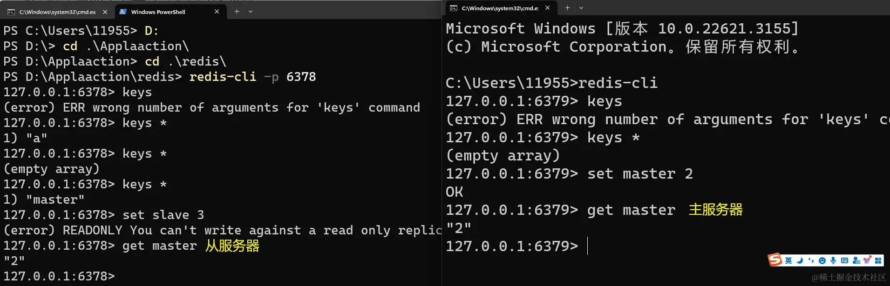

## 介绍
Redis主从复制是一种数据复制和同步机制，其中一个Redis服务器（称为主服务器）将其数据复制到一个或多个其他Redis服务器（称为从服务器）。主从复制提供了数据冗余备份、读写分离和故障恢复等功能。

Redis主从复制的一般工作流程：

1、配置主服务器：在主服务器上，你需要在配置文件中启用主从复制并指定从服务器的IP地址和端口号。你可以使用replicaof配置选项或slaveof配置选项来指定从服务器。

2、连接从服务器：从服务器连接到主服务器并发送复制请求。从服务器通过发送SYNC命令请求进行全量复制或通过发送PSYNC命令请求进行部分复制（增量复制）。

3、全量复制（SYNC）：如果从服务器是第一次连接或无法执行部分复制，主服务器将执行全量复制。在全量复制期间，主服务器将快照文件（RDB文件）发送给从服务器，从服务器将接收并加载该文件以完全复制主服务器的数据。

4、部分复制（PSYNC）：如果从服务器已经执行过全量复制并建立了复制断点，主服务器将执行部分复制。在部分复制期间，主服务器将发送增量复制流（replication stream）给从服务器，从服务器将接收并应用该流以保持与主服务器的同步。

5、复制持久化：从服务器接收到数据后，会将其保存在本地磁盘上，以便在重启后仍然保持数据的一致性。

6、同步延迟：从服务器的复制是异步的，因此存在复制延迟。延迟取决于网络延迟、主服务器的负载和从服务器的性能等因素。

7、读写分离：一旦建立了主从复制关系，从服务器可以接收读操作。这使得可以将读流量从主服务器分散到从服务器上，从而减轻主服务器的负载。

8、故障恢复：如果主服务器发生故障，可以将一个从服务器提升为新的主服务器，以继续提供服务。当主服务器恢复时，它可以作为从服务器连接到新的主服务器，继续进行数据复制。

## 配置

### wind、mac安装包或者整体包

在根目录下面新建一个 redis-6378.conf 配置文件 作为redis从服务器,默认的配置文件6379作为主服务器

redis-6378.conf 文件配置
```editorconfig
bind 127.0.0.1 #ip地址
port 6378 #端口号
daemonize yes #守护线程静默运行
replicaof 127.0.0.1 6379 #指定主服务器
```
启动从服务器
```shell
redis-server ./redis-6378.conf 指定配置文件
```
打开从服务器cli
```shell
redis-cli -p 6378 # 指定ip 6378
```
启动主服务器
```shell
redis-cli # 直接启动就是主服务器中的配置文件
```
主服务器写入一个值
```shell
set name 'elk'
```
从服务器直接同步过来这个值 就可以直接获取到

> 注意从服务器是不允许写入的操作



### docker中的redis
具体如何在docker 添加配置文件启动redis上一章已经讲过了[配置启动](35-redis-lasting.md)

1、分别以不同的redis.conf启动一个容器
```shell
# 主服务器redis.conf
bind 127.0.0.1 #ip地址
port 6379 #端口号
daemonize yes #守护线程静默运行

# 从服务器redis.conf
bind 127.0.0.1 #ip地址
port 6378 #端口号
daemonize yes #守护线程静默运行
replicaof 127.0.0.1 6379 #指定主服务器


```
