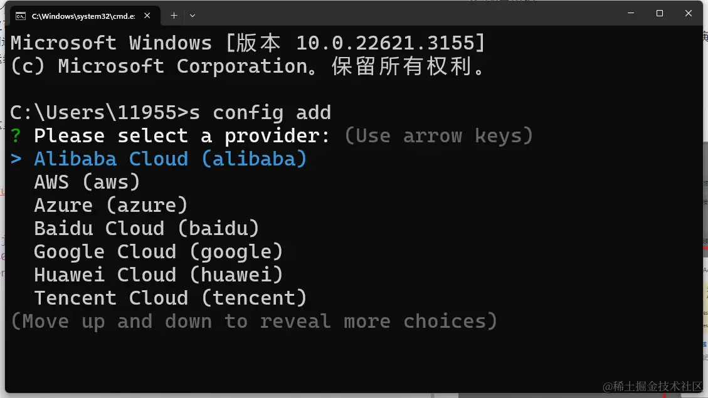
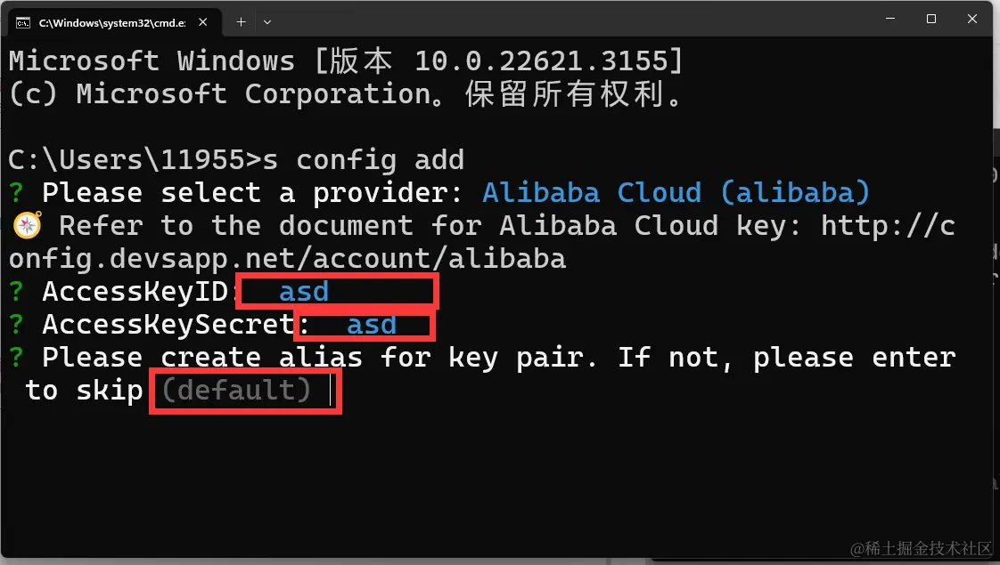
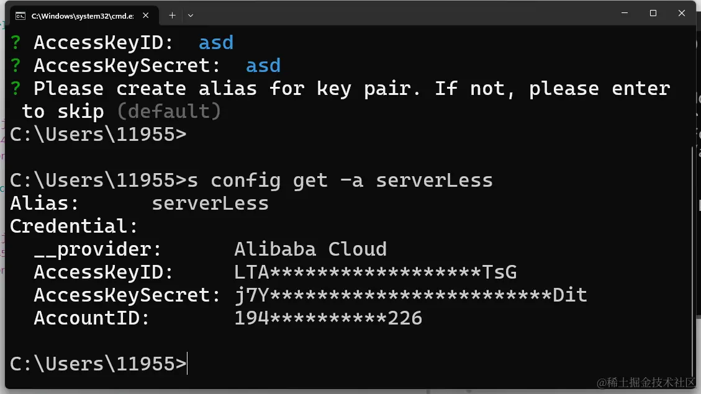
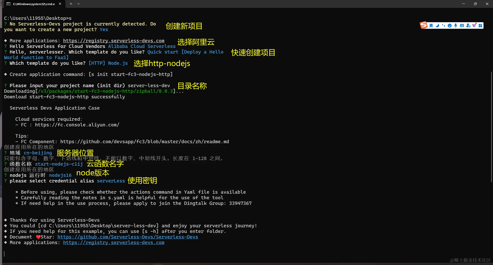
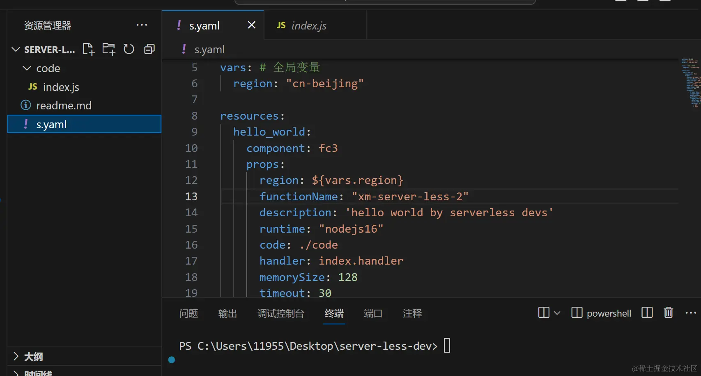
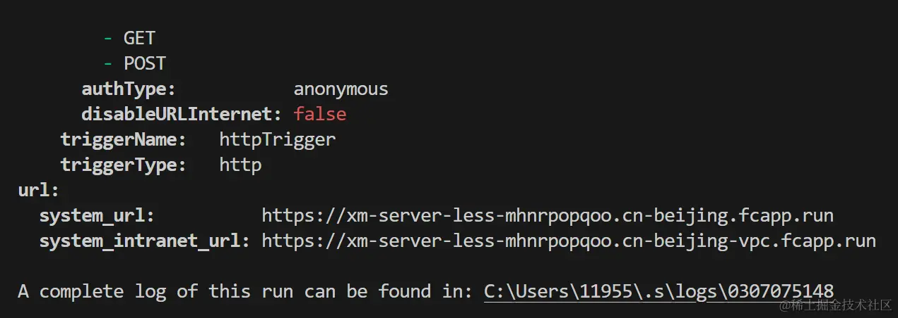
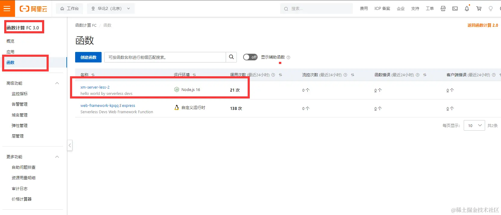
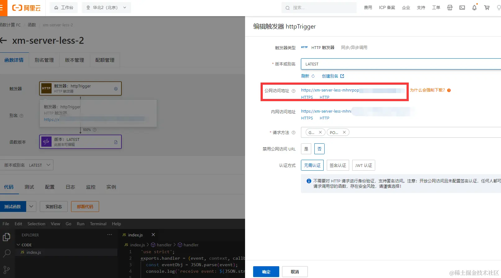
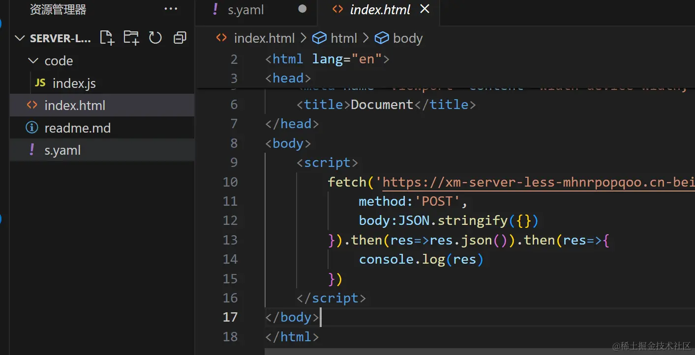
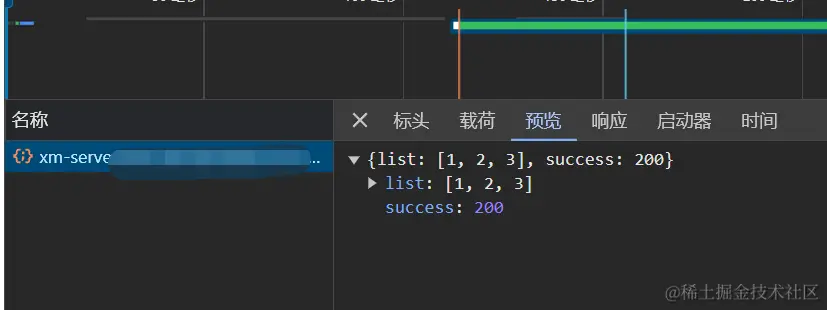

## 介绍
serverLess并不是一个技术，他只是一种架构模型，(无服务器架构)，在传统模式下，我们部署一个服务，需要选择服务器Linux,windows等,并且还要安装环境，熟悉操作系统命令，知晓安全知识等，有一定成本，serverLess，核心思想就是，让开发者更多的是关注业务本身，而不是服务器运行成本。

## FaaS与BaaS

1、函数即服务（FaaS）：

FaaS是一种Serverless计算模型，它允许开发人员编写和部署函数代码，而无需关心底层的服务器管理。在FaaS中，开发人员只需关注函数的实现和逻辑，将其上传到云平台上，平台会负责函数的运行和扩展。当有请求触发函数时，云平台会自动为函数提供所需的计算资源，并根据请求量进行弹性扩展。这种按需计算的模式使开发人员可以更专注于业务逻辑的实现，同时实现了资源的高效利用。

每个函数即一个服务，函数内只需处理业务，可以使用BASS层提供的服务已完成业务，无需关心背后计算资源的问题。

2、后端即服务（BaaS）：

后端即服务是一种提供面向移动应用和Web应用的后端功能的云服务模型。BaaS为开发人员提供了一组预构建的后端服务，如用户身份验证、数据库存储、文件存储、推送通知等，以简化应用程序的开发和管理。开发人员可以使用BaaS平台提供的API和SDK，直接集成这些功能到他们的应用中，而无需自己构建和维护后端基础设施。

对后端的资源当成一种服务，如文件存储，数据存储，推送服务，身份验证。该层只需提供对应的服务，无需关心业务。定义为底层基础服务，由其他服务调用，正常不触及用户终端。

## 代码编写
安装依赖
```shell
npm install @serverless-devs/s -g
```
[serverless-devs文档](https://www.npmjs.com/package/@serverless-devs/s)

**Serverless Devs**是一个开源开放的 Serverless 开发者平台，致力于为开发者提供强大的工具链体系。通过该平台，开发者不仅可以一键体验多云 Serverless 产品，极速部署 Serverless 项目，还可以在 Serverless 应用全生命周期进行项目的管理，并且非常简单快速的将 Serverless Devs 与其他工具/平台进行结合，进一步提升研发、运维效能。

1、配置密匙

[访问此链接，登录阿里云](https://ram.console.aliyun.com/profile/access-keys)


2、添加密匙

s命令 你安装完成 @serverless-devs/s 这个之后就有了

```shell
s config add
```


选择阿里云 输入刚才的 AccessKeyID AccessKeySecret 第三个是个别名可以自定义



检查密钥是否正确,能输出信息就是对的

```shell
s config get -a [别名]
```


3、创建项目
```shell
s 
```



打开生成好的项目



在目录下执行

```shell
s deploy
```

上传成功



[访问此链接找到你的函数](https://fcnext.console.aliyun.com/cn-beijing/functions)




调用该函数




原创：https://juejin.cn/post/7343138804483276800
