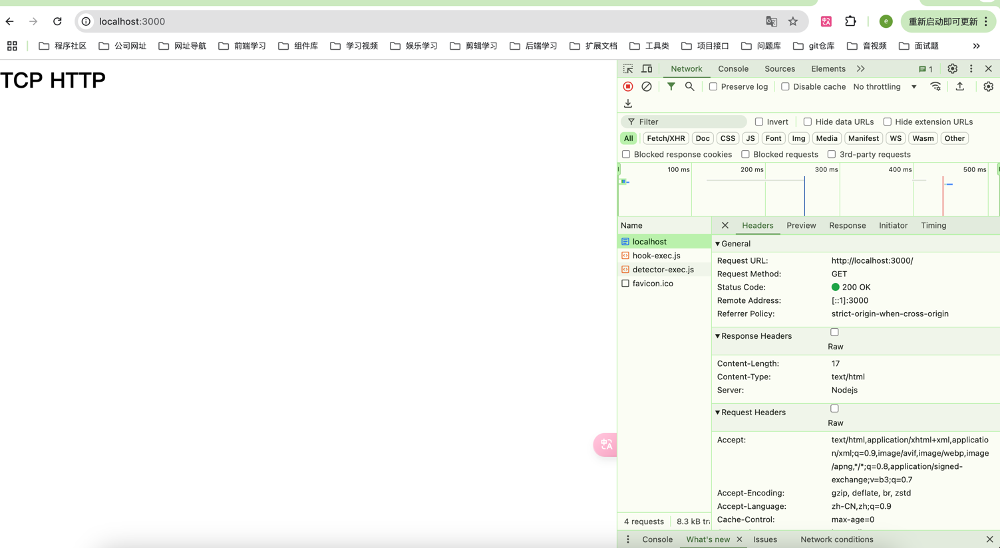

## 介绍
net模块是Node.js的核心模块之一，它提供了用于创建基于网络的应用程序的API。net模块主要用于创建TCP服务器和TCP客户端，以及处理网络通信。


TCP（Transmission Control Protocol）是一种面向连接的、可靠的传输协议，用于在计算机网络上进行数据传输。它是互联网协议套件（TCP/IP）的一部分，是应用层和网络层之间的传输层协议。
TCP的主要特点包括：

- 可靠性：TCP通过使用确认机制、序列号和重传策略来确保数据的可靠传输。它可以检测并纠正数据丢失、重复、损坏或失序的问题。
- 面向连接：在进行数据传输之前，TCP需要在发送方和接收方之间建立一个连接。连接的建立是通过三次握手来完成的，确保双方都准备好进行通信。
- 全双工通信：TCP支持双方同时进行双向通信，即发送方和接收方可以在同一时间发送和接收数据。
- 流式传输：TCP将数据视为连续的字节流进行传输，而不是离散的数据包。发送方将数据划分为较小的数据块，但TCP在传输过程中将其作为连续的字节流处理。
- 拥塞控制：TCP具备拥塞控制机制，用于避免网络拥塞和数据丢失。它通过动态调整发送速率、使用拥塞窗口和慢启动算法等方式来控制数据的发送速度。

## 场景
### 服务端之间的通讯
服务端之间的通讯可以直接使用TCP通讯，而不需要上升到http层

- server.js

创建一个TCP服务，发送套接字
```javascript
import net from 'node:net'

const server = net.createServer( (socket) => {
    const interVal = setInterval(() => {
        socket.write("hello I'm server")
    },1000)
    //监听连接中断
    socket.on("end", () => {
        console.log("连接中断啦！")
        clearInterval(interVal)
    })
    //通过on来监听接收client发送的数据
    socket.on("data", (data) => {
        console.log("server接收：", data.toString())
    })
})

server.listen(8822, () => {
    console.log("TCP服务启动成功！")
})
```
- client.js

连接server端，监听返回的数据
```javascript
import net from 'node:net'

const client = net.createConnection({
    host: '127.0.0.1',
    port: 8822
})

client.on("data", (data) => {
    console.log("client接收:", data.toString())
})

//因为是全通信，client也可以发送数据
client.write("I got it thank you")
```
### 从传输层实现http协议
创建一个TCP服务
```javascript
import net from 'net'

const http = net.createServer((socket) => {
    socket.on('data', (data) => {
        console.log(data.toString())
    })
})
http.listen(3000,()=>{
     console.log('listening on 3000')
})
```
此时直接在网址访问


- http.js
```javascript
import net from 'node:net';
const html = '<h1>TCP HTTP</h1>'
const responseHeader = [
    'HTTP/1.1 200 OK',
    'Content-Type: text/html',
    'Content-Length: ' + html.length,
    'Server: Nodejs',
    '\r\n',
    html
]
const http = net.createServer( (socket) => {
    socket.on("data",(data) => {
        if(/GET/.test(data.toString())) {
            socket.write(responseHeader.join('\r\n'));
            socket.end();
        }
    })
})
http.listen(3000,()=> {
    console.log("服务启动成功！")
})
```

