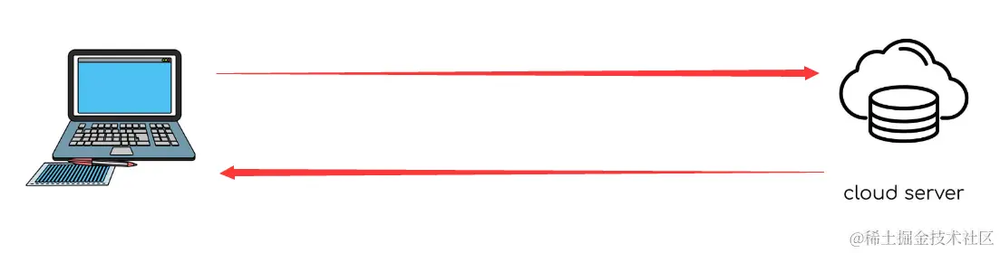
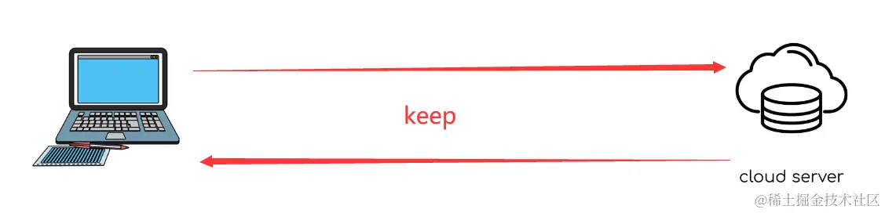

## 介绍
传统的 HTTP 是一种单向请求-响应协议，客户端发送请求后，服务器才会响应并返回相应的数据。在传统的 HTTP 中，客户端需要主动发送请求才能获取服务器上的资源，而且每次请求都需要重新建立连接，这种方式在实时通信和持续获取资源的场景下效率较低。



Socket 提供了实时的双向通信能力，可以实时地传输数据。客户端和服务器之间的通信是即时的，数据的传输和响应几乎是实时完成的，不需要轮询或定时发送请求



## 依赖安装

[socket.io中文文档](https://socket.io/zh-CN)

Socket.IO 是一个基于事件驱动的实时通信框架，用于构建实时应用程序。它提供了双向、低延迟的通信能力，使得服务器和客户端可以实时地发送和接收数据。

Socket.IO 的主要特点包括：

- **实时性**: Socket.IO 构建在 WebSocket 协议之上，使用了 WebSocket 连接来实现实时通信。WebSocket 是一种双向通信协议，相比传统的 HTTP 请求-响应模型，它可以实现更快速、低延迟的数据传输。
- **事件驱动**: Socket.IO 使用事件驱动的编程模型。服务器和客户端可以通过触发事件来发送和接收数据。这种基于事件的通信模式使得开发者可以轻松地构建实时的应用程序，例如聊天应用、实时协作工具等。
- **跨平台支持**: Socket.IO 可以在多个平台上使用，包括浏览器、服务器和移动设备等。它提供了对多种编程语言和框架的支持，如 JavaScript、Node.js、Python、Java 等，使得开发者可以在不同的环境中构建实时应用程序。
- **容错性**: Socket.IO 具有容错能力，当 WebSocket 连接不可用时，它可以自动降级到其他传输机制，如 HTTP 长轮询。这意味着即使在不支持 WebSocket 的环境中，Socket.IO 仍然可以实现实时通信。
- **扩展性**: Socket.IO 支持水平扩展，可以将应用程序扩展到多个服务器，并实现事件的广播和传递。这使得应用程序可以处理大规模的并发连接，并实现高可用性和高性能

客户端安装
```shell
npm install socket.io
```
浏览器使用esm
```html
<script type="module">
import { io } from "https://cdn.socket.io/4.7.4/socket.io.esm.min.js";
 const socket = io('ws://localhost:3000'); //ws的地址
</script>
```
## 聊天室案例
### index.html
```html
<!DOCTYPE html>
<html lang="en">
	<head>
		<title>聊天室</title>
		<meta charset="UTF-8" />
		<meta name="viewport" content="width=device-width, initial-scale=1" />
		<style>
			* {
				padding: 0;
				margin: 0;
			}

			html,
			body,
			.room {
				height: 100%;
				width: 100%;
			}

			.room {
				display: flex;
			}

			.left {
				width: 300px;
				border-right: 0.5px solid #f5f5f5;
				background: #b97e7e18;
			}

			.right {
				background: #cfbcbc;
				flex: 1;
				display: flex;
				flex-direction: column;
			}

			.header {
				background: #d19638;
				color: white;
				padding: 10px;
				box-sizing: border-box;
				font-size: 20px;
			}

			.main {
				flex: 1;
				padding: 10px;
				box-sizing: border-box;
				font-size: 20px;
				overflow: auto;
			}

			.main-chat {
				color: rgb(179, 169, 127);
			}

			.footer {
				min-height: 200px;
				border-top: 1px solid green;
			}

			.footer .ipt {
				width: 100%;
				height: 100%;
				color: green;
				outline: none;
				font-size: 20px;
				padding: 10px;
				box-sizing: border-box;
			}

			.groupList {
				height: 100%;
				overflow: auto;
			}

			.groupList-items {
				height: 50px;
				width: 100%;
				background: #131313;
				display: flex;
				align-items: center;
				justify-content: center;
				color: white;
			}
		</style>
	</head>
	<body>
		<div id="app" class="room">
			<!-- 左侧房间栏 -->
			<div class="left">
				<div class="groupList"></div>
			</div>
			<!-- 右侧房间内容区域 -->
			<div class="right">
				<!-- 右上  房间消息内容区 -->
				<header class="header">聊天室</header>
				<main class="main"></main>
				<!-- 右下 房间输入内容框 -->
				<footer class="footer">
					<div class="ipt" contenteditable></div>
				</footer>
			</div>
		</div>
		<script type="module">
			const sendMessage = (message) => {
				const div = document.createElement("div");
				div.className = "main-chat";
				div.innerText = `${message.user}:${message.text}`;
				main.appendChild(div);
			};
			const groupEl = document.querySelector(".groupList");
			const main = document.querySelector(".main");
			import { io } from "https://cdn.socket.io/4.7.4/socket.io.esm.min.js";
			const socket = io("ws://localhost:3000"); //ws的地址
			const name = prompt("请输入用户名");
			const room = prompt("请输入房间号");
			//键盘按下发送消息
			document.addEventListener("keydown", (e) => {
				if (e.key === "Enter") {
					e.preventDefault();
					const ipt = document.querySelector(".ipt");
					socket.emit("message", {
						text: ipt.innerText,
						room: room,
						user: name,
					});
					sendMessage({
						text: ipt.innerText,
						user: name,
					});
					ipt.innerText = "";
				}
			});
			// 连接通道
			socket.on("connect", () => {
				// 触发用户进入房间信息
				socket.emit("join", { name, room });
				// 监听用户进入房间后得到的消息通知
				socket.on("message", (message) => {
					sendMessage(message);
					// console.log("message:", message);
				});
				// 获取房间列表
				socket.on("groupList", (groupList) => {
					groupEl.innerHTML = "";
					Object.keys(groupList).forEach((key) => {
						const item = document.createElement("div");
						item.className = "groupList-items";
						item.innerText = `房间名称:${key} 房间人数:${groupList[key].length}`;
						groupEl.appendChild(item);
					});
					// console.log("groupList", groupList);
				});
			});
		</script>
	</body>
</html>

```
### app.js
```javascript
/*
 * @Author: elk
 * @Date: 2024-11-13 14:32:34
 * @LastEditors: elk 
 * @LastEditTime: 2024-11-13 18:29:51
 * @FilePath: /NodeJs/26-socketIO/app.js
 * @Description: socket.io
 */

import http from "node:http";
import express from "express";
import { Server } from "socket.io";

const app = express();
app.use("*", (req, res, next) => {
	res.setHeader("Access-Control-Allow-Origin", "*");
	res.setHeader("Access-Control-Allow-Headers", "*");
	res.setHeader("Access-Control-Allow-Methods", "*");
	next();
});
const server = http.createServer(app);

const io = new Server(server, {
	cors: true, // 允许跨域
});

/**
 * {
 *  1: [{name, room, id}]
 *  2: [{name, room, id}, {name, room, id}]
 * }
 */
const groupList = {};

// 开启socket连接通道
io.on("connection", (socket) => {
	console.log("开启通道，连接成功");
	// 开启并加入一个房间，接受用户名和房间号两个参数
	socket.on("join", ({ name, room }) => {
		// 加入房间
		socket.join(room);
		// 如果房间存在，新增push人进去，否则直接赋值即可
		if (groupList[room]) {
			groupList[room].push({ name, room, id: socket.id });
		} else {
			groupList[room] = [{ name, room, id: socket.id }];
		}
		// 通知放假内其他用户有新入户加入
		socket.broadcast.emit("message", { user: "管理员：", text: `${name}进入了房间` });
		// 设置左侧房间列表信息
		socket.emit("groupList", groupList);
		// 将gruopList消息上升到全局中，全部人都可以看到
		socket.broadcast.emit("groupList", groupList);
	});
	// 发送消息
	socket.on("message", ({ text, room, user }) => {
        // 监听客户端用户输入的消息，通知给当前房间的其他用户
		socket.broadcast.to(room).emit("message", {
			text,
			user,
		});
	});
	//断开链接内置事件
	socket.on("disconnect", () => {
		Object.keys(groupList).forEach((key) => {
			let leval = groupList[key].find((item) => item.id === socket.id);
			if (leval) {
				socket.broadcast.to(leval.room).emit("message", { user: "管理员", text: `${leval.name}离开了房间` });
			}
			groupList[key] = groupList[key].filter((item) => item.id !== socket.id);
		});
		socket.broadcast.emit("groupList", groupList);
	});
});

server.listen(3000, () => {
	console.log("listening on *:3000");
});

```
